# OmniRoute Codebase Documentation

> **Version:** v3.8.0
> **Last updated:** 2026-06-28
> **Audience:** Engineers contributing to OmniRoute or building integrations on top of it.
>
> For high-level architecture diagrams and the reasoning behind each subsystem, read
> [ARCHITECTURE.md](./ARCHITECTURE.md). For deep dives on individual subsystems
> (Auto Combo, MCP server, A2A server, Skills, Memory, Cloud Agents, Resilience,
> Compression, etc.) see their dedicated files in this `docs/` directory.

This file describes **what exists in the repository today** so that a new engineer
can navigate the tree, understand the runtime layering, and know where to add code
without inventing new modules.

---

## 1. Tech Stack

| Concern       | Choice                                                                                                                   |
| ------------- | ------------------------------------------------------------------------------------------------------------------------ |
| Web framework | **Next.js 16** (App Router, standalone output, no global middleware)                                                     |
| Language      | **TypeScript 6.0+** — target `ES2022`, `module: esnext`, `moduleResolution: bundler`, `strict: false`                    |
| Runtime       | **Node.js** `>=22.22.2 <23` or `>=24.0.0 <27` (enforced via `engines` + `SUPPORTED_NODE_RANGE`)                          |
| Database      | **SQLite** via `better-sqlite3` (singleton, WAL journaling)                                                              |
| Desktop       | **Electron 41** + `electron-builder` 26.10 (separate workspace at `electron/`)                                           |
| Tests         | **Node native test runner** (unit/integration), **Vitest** (MCP, autoCombo, cache), **Playwright** (e2e + protocols-e2e) |
| Build         | Next.js standalone via `scripts/build/build-next-isolated.mjs`                                                           |
| Lint/format   | ESLint flat config + Prettier (`lint-staged` via Husky pre-commit)                                                       |
| Module system | ESM everywhere (`"type": "module"`)                                                                                      |
| Workspaces    | npm workspace — `open-sse` is the only sub-workspace                                                                     |

Path aliases (`tsconfig.json`):

- `@/*` → `src/*`
- `@omniroute/open-sse` → `open-sse/index.ts`
- `@omniroute/open-sse/*` → `open-sse/*`

Default HTTP port: **`20128`** (API and dashboard share the same process). Data
directory is `DATA_DIR` env var, defaulting to `~/.omniroute/`.

---

## 2. Repository Layout

```
OmniRoute/
├── src/                  Next.js application (App Router, libs, domain, server, shared)
├── open-sse/             Streaming engine workspace (@omniroute/open-sse)
├── electron/             Desktop wrapper (Electron 41 main + preload)
├── bin/                  CLI entry points (omniroute, reset-password)
├── tests/                Unit, integration, e2e, protocols-e2e, translator, security, fixtures
├── scripts/              Build, sync, check, migration, and runtime helper scripts
├── docs/                 Public documentation (this directory)
├── public/               Static assets, PWA manifest, service worker
├── config/               Runtime config samples
├── images/               Marketing/screenshot assets
├── _ideia/, _references/, _mono_repo/, _tasks/   Internal scratch / planning (not shipped)
├── CLAUDE.md             Repo rules for Claude Code
├── AGENTS.md             Deeper architecture reference for agents
├── package.json          v3.8.0, workspace root
└── tsconfig.json         Path aliases + core compiler options
```

---

## 3. `src/` — Next.js Application

```
src/
├── app/                  App Router pages + API routes
├── lib/                  Core libraries (DB, auth, OAuth, skills, memory, …)
├── domain/               Pure domain layer (policy, fallback, cost, lockout, …)
├── server/               Server-only modules (authz, cors, auth)
├── shared/               Types, constants, validation, contracts, utils (cross-boundary safe)
├── mitm/                 Man-in-the-middle proxy helpers for CLI integration
├── models/               Local model metadata / aliasing
├── sse/                  Legacy SSE handlers that still live under src/ (not open-sse/)
├── store/                Client-side state stores
├── middleware/           Route-level middleware utilities (not Next.js global middleware)
├── scripts/              In-tree scripts importable by app code
├── types/                Ambient and shared TS types
├── i18n/                 Locale bundles
├── instrumentation.ts    Next.js instrumentation hook
├── instrumentation-node.ts
├── server-init.ts        Process-level bootstrap (env, DB, jobs, sync)
└── proxy.ts              Top-level proxy bootstrap helper
```

### 3.1 `src/app/` — App Router

The App Router exposes both the dashboard UI and the public/management HTTP API.
There is **no global middleware** — interception is done per-route.

Top-level segments under `src/app/`:

| Path                                                                          | Purpose                                   |
| ----------------------------------------------------------------------------- | ----------------------------------------- |
| `api/`                                                                        | All HTTP API routes (see breakdown below) |
| `a2a/`                                                                        | A2A JSON-RPC 2.0 endpoint (`POST /a2a`)   |
| `.well-known/agent.json/`                                                     | A2A Agent Card discovery document         |
| `(dashboard)/`                                                                | Dashboard UI (route group, no URL prefix) |
| `auth/`, `login/`, `forgot-password/`, `callback/`                            | Auth flows                                |
| `landing/`                                                                    | Marketing/landing page                    |
| `docs/`                                                                       | Embedded API docs viewer                  |
| `status/`, `maintenance/`, `offline/`                                         | Operational pages                         |
| `privacy/`, `terms/`                                                          | Legal pages                               |
| `400/`, `401/`, `403/`, `408/`, `429/`, `500/`, `502/`, `503/`                | Static error pages                        |
| `error.tsx`, `global-error.tsx`, `not-found.tsx`, `forbidden/`, `loading.tsx` | Framework error/loading boundaries        |
| `layout.tsx`, `page.tsx`, `globals.css`, `manifest.ts`                        | Root shell                                |

#### 3.1.1 `src/app/(dashboard)/dashboard/` — UI pages

`agents`, `analytics`, `api-manager`, `audit`, `auto-combo`, `batch`, `cache`,
`changelog`, `cli-tools`, `cloud-agents`, `combos`, `compression`, `context`,
`costs`, `endpoint`, `health`, `limits`, `logs`, `memory`, `onboarding`,
`playground`, `providers`, `search-tools`, `settings`, `skills`, `system`,
`translator`, `usage`, `webhooks`, plus root `page.tsx`, `HomePageClient.tsx`,
`BootstrapBanner.tsx`.

#### 3.1.2 `src/app/api/` — Top-level API groups

```
src/app/api/
├── a2a/{status, tasks}
├── acp/
├── admin/
├── analytics/
├── assess/
├── auth/
├── batches/
├── cache/
├── cli-tools/
├── cloud/{codex-responses-ws}
├── combos/
├── compliance/
├── compression/
├── context/
├── db/, db-backups/
├── evals/
├── fallback/
├── files/
├── health/
├── init/
├── internal/{concurrency}
├── keys/
├── logs/
├── mcp/{audit, sse, status, stream, tools}
├── memory/{health, [id]/, route.ts}
├── model-combo-mappings/
├── models/
├── monitoring/
├── oauth/
├── openapi/
├── policies/
├── pricing/
├── provider-metrics/, provider-models/, provider-nodes/
├── providers/
├── rate-limit/, rate-limits/
├── resilience/
├── restart/, shutdown/
├── search/
├── sessions/
├── settings/
├── skills/{executions, [id], install, marketplace, route.ts, skillssh}
├── storage/
├── sync/, synced-available-models/
├── system/
├── tags/
├── telemetry/
├── token-health/
├── translator/
├── tunnels/
├── services/   Embedded service management (9router, cliproxy) — LOCAL_ONLY
├── upstream-proxy/
├── usage/
├── v1/         OpenAI-compatible public API
├── v1beta/     Gemini-style compat
├── version-manager/
└── webhooks/
```

#### 3.1.2a `src/app/api/services/` — Embedded Services management

Routes for installing, starting, stopping, and monitoring 9Router and CLIProxyAPI.
All paths are classified **LOCAL_ONLY** (loopback only, hard rule #17) because they
can invoke `npm install` and spawn child processes.

```
src/app/api/services/
├── 9router/
│   ├── _lib.ts             getOrInitSupervisor() helper
│   ├── install/route.ts    POST — npm install via execFile
│   ├── start/route.ts      POST — supervisor.start()
│   ├── stop/route.ts       POST — supervisor.stop()
│   ├── restart/route.ts    POST — supervisor.restart()
│   ├── update/route.ts     POST — npm install newer version
│   ├── rotate-key/route.ts POST — generate new API key + restart
│   ├── status/route.ts     GET  — live + DB status + version metadata
│   └── auto-start/route.ts POST — toggle auto_start flag
├── cliproxy/
│   ├── _lib.ts             getOrInitSupervisor() helper
│   ├── install/route.ts    POST — npm install
│   ├── start/route.ts      POST — supervisor.start()
│   ├── stop/route.ts       POST — supervisor.stop()
│   ├── restart/route.ts    POST — supervisor.restart()
│   ├── update/route.ts     POST — npm install newer version
│   ├── status/route.ts     GET  — live + DB status + version metadata
│   └── auto-start/route.ts POST — toggle auto_start flag
└── [name]/
    └── logs/route.ts       GET  — SSE log tail (shared by all services)
```

Corresponding dashboard UI:
`src/app/(dashboard)/dashboard/providers/services/` — two-tab page (CLIProxyAPI + 9Router).
Reverse proxy for 9Router embedded UI:
`src/app/(dashboard)/dashboard/providers/services/[name]/embed/[...path]/route.ts`

Deep-dive: `docs/frameworks/EMBEDDED-SERVICES.md`

#### 3.1.3 `src/app/api/v1/` — OpenAI-compatible public API

```
v1/
├── accounts/[id]/                       account lookup
├── agents/tasks/[id]/, agents/tasks/    A2A-flavored task endpoints
├── api/                                 internal API helpers exposed under v1/api
├── audio/{speech, transcriptions}/      TTS + STT
├── batches/[id]/{cancel}, batches/      OpenAI Batches API
├── chat/completions/                    Chat Completions (the main endpoint)
├── chatgpt-web/                         ChatGPT-Web compat
├── completions/                         Legacy text completions
├── embeddings/                          Embeddings
├── files/[id]/, files/                  Files API
├── _helpers/                            Shared route helpers (no public URL)
├── images/{edits, generations}/         Image gen + edit
├── issues/                              Triage helper endpoints
├── management/{proxies}/                Management-scoped routes inside v1
├── messages/{count_tokens}/             Anthropic-style messages compat
├── models/                              Model listing (`route.ts`, `catalog.ts`)
├── moderations/                         Moderation
├── music/                               Music gen
├── providers/[provider]/                Per-provider operations
├── quotas/{check}                       Quota probes
├── registered-keys/                     Registered key admin
├── rerank/                              Reranking
├── responses/[...path]/                 OpenAI Responses API (catch-all)
├── search/                              Web search
├── videos/                              Video gen
├── ws/                                  WebSocket bridge
└── route.ts                             Index handler
```

Every route file follows the same pattern:

```
Route → CORS preflight → Zod body validation → optional auth
      → API key policy enforcement → handler delegation (open-sse)
```

`v1beta/` is the Gemini-style compat surface (a thin wrapper that translates into
the same `open-sse/handlers/` pipeline).

### 3.2 `src/lib/` — Core libraries

Always import data, sync, OAuth, skill, memory, etc. through these modules. The
table groups the actual directories and notable top-level files.

| Module            | Purpose                                                                                                                                                                                                                                                                                                                                                                                                                                                                                                                                                                                                                                                                          |
| ----------------- | -------------------------------------------------------------------------------------------------------------------------------------------------------------------------------------------------------------------------------------------------------------------------------------------------------------------------------------------------------------------------------------------------------------------------------------------------------------------------------------------------------------------------------------------------------------------------------------------------------------------------------------------------------------------------------- |
| `a2a/`            | A2A protocol server: `taskManager.ts`, `streaming.ts`, `taskExecution.ts`, `routingLogger.ts`, `skills/` (6 skills: cost analysis, health report, provider discovery, quota management, smart routing, list-capabilities)                                                                                                                                                                                                                                                                                                                                                                                                                                                        |
| `acp/`            | Agent-Control-Protocol: `index.ts`, `manager.ts`, `registry.ts`                                                                                                                                                                                                                                                                                                                                                                                                                                                                                                                                                                                                                  |
| `api/`            | Internal API helpers: `requireManagementAuth.ts`, `requireCliToolsAuth.ts`, `errorResponse.ts`                                                                                                                                                                                                                                                                                                                                                                                                                                                                                                                                                                                   |
| `auth/`           | `managementPassword.ts` (password reset / hashing)                                                                                                                                                                                                                                                                                                                                                                                                                                                                                                                                                                                                                               |
| `batches/`        | OpenAI Batches API service (`service.ts`)                                                                                                                                                                                                                                                                                                                                                                                                                                                                                                                                                                                                                                        |
| `catalog/`        | OpenRouter catalog sync (`openrouterCatalog.ts`)                                                                                                                                                                                                                                                                                                                                                                                                                                                                                                                                                                                                                                 |
| `cloudAgent/`     | Cloud agent registry: `api.ts`, `baseAgent.ts`, `db.ts`, `index.ts`, `registry.ts`, `types.ts`, `agents/{codex, devin, jules}.ts`                                                                                                                                                                                                                                                                                                                                                                                                                                                                                                                                                |
| `combos/`         | Combo resolution helpers                                                                                                                                                                                                                                                                                                                                                                                                                                                                                                                                                                                                                                                         |
| `compliance/`     | Audit + provider audit: `index.ts`, `providerAudit.ts`                                                                                                                                                                                                                                                                                                                                                                                                                                                                                                                                                                                                                           |
| `config/`         | Runtime config glue                                                                                                                                                                                                                                                                                                                                                                                                                                                                                                                                                                                                                                                              |
| `db/`             | SQLite domain modules (see §3.2.1)                                                                                                                                                                                                                                                                                                                                                                                                                                                                                                                                                                                                                                               |
| `display/`        | UI/display helpers used by API responses                                                                                                                                                                                                                                                                                                                                                                                                                                                                                                                                                                                                                                         |
| `embeddings/`     | Embedding service registry                                                                                                                                                                                                                                                                                                                                                                                                                                                                                                                                                                                                                                                       |
| `env/`            | Env loading + introspection                                                                                                                                                                                                                                                                                                                                                                                                                                                                                                                                                                                                                                                      |
| `evals/`          | Eval runtime                                                                                                                                                                                                                                                                                                                                                                                                                                                                                                                                                                                                                                                                     |
| `guardrails/`     | `piiMasker.ts`, `promptInjection.ts`, `visionBridge.ts`, `visionBridgeHelpers.ts`, `registry.ts`, `base.ts`                                                                                                                                                                                                                                                                                                                                                                                                                                                                                                                                                                      |
| `jobs/`           | Background jobs (`autoUpdate.ts`, …)                                                                                                                                                                                                                                                                                                                                                                                                                                                                                                                                                                                                                                             |
| `memory/`         | Persistent memory: `store.ts`, `cache.ts`, `retrieval.ts`, `summarization.ts`, `extraction.ts`, `injection.ts`, `qdrant.ts`, `settings.ts`, `verify.ts`, `schemas.ts`, `types.ts`                                                                                                                                                                                                                                                                                                                                                                                                                                                                                                |
| `monitoring/`     | `observability.ts`                                                                                                                                                                                                                                                                                                                                                                                                                                                                                                                                                                                                                                                               |
| `oauth/`          | OAuth providers (13): `antigravity`, `claude`, `cline`, `codex`, `cursor`, `gemini`, `github`, `gitlab-duo`, `kilocode`, `kimi-coding`, `kiro`, `qoder`, `windsurf` plus `services/`, `utils/{pkce, server, banner, codexAuthFile, ui}`, `constants/oauth.ts`                                                                                                                                                                                                                                                                                                                                                                                                                    |
| `plugins/`        | Plugin loader (`index.ts`)                                                                                                                                                                                                                                                                                                                                                                                                                                                                                                                                                                                                                                                       |
| `promptCache/`    | `prefixAnalyzer.ts`, `index.ts`                                                                                                                                                                                                                                                                                                                                                                                                                                                                                                                                                                                                                                                  |
| `providerModels/` | Managed model lifecycle: `modelDiscovery.ts`, `managedModelImport.ts`, `managedAvailableModels.ts`, `cursorAgent.ts`                                                                                                                                                                                                                                                                                                                                                                                                                                                                                                                                                             |
| `providers/`      | Provider helpers: `catalog.ts`, `validation.ts`, `imageValidation.ts`, `claudeExtraUsage.ts`, `codexConnectionDefaults.ts`, `codexFastTier.ts`, `webCookieAuth.ts`, `managedAvailableModels.ts`, `requestDefaults.ts`                                                                                                                                                                                                                                                                                                                                                                                                                                                            |
| `resilience/`     | `settings.ts` — settings for circuit breaker, cooldown, lockout                                                                                                                                                                                                                                                                                                                                                                                                                                                                                                                                                                                                                  |
| `runtime/`        | Runtime feature detection                                                                                                                                                                                                                                                                                                                                                                                                                                                                                                                                                                                                                                                        |
| `search/`         | `executeWebSearch.ts`                                                                                                                                                                                                                                                                                                                                                                                                                                                                                                                                                                                                                                                            |
| `services/`       | Embedded services framework: `ServiceSupervisor.ts` (generic child-process supervisor with operation lock, ring buffer, health checker), `bootstrap.ts` (process-level registration and auto-start), `registry.ts` (tool → supervisor map), `apiKey.ts` (AES-256-GCM key store), `modelSync.ts` (periodic model sync), `ringBuffer.ts` (5 MB circular log buffer), `healthCheck.ts` (HTTP health probe), `types.ts`, `embedWsProxy.ts` (WebSocket proxy), `installers/{ninerouter,cliproxy}.ts`. See `docs/frameworks/EMBEDDED-SERVICES.md`                                                                                                                                      |
| `agentSkills/`    | Agent Skills catalog + generator: `catalog.ts` (getCatalog/getSkillById/filterCatalog/computeCoverage), `generator.ts` (generateAgentSkills → writes `skills/{id}/SKILL.md`), `openapiParser.ts` (extracts REST endpoints from OpenAPI spec), `cliRegistryParser.ts` (extracts CLI subcommands from bin/cli-registry), `schemas.ts` (Zod: AgentSkillSchema, SkillCoverageSchema, ListQuerySchema, GenerateBodySchema), `types.ts` (AgentSkill, SkillCoverage, SkillMarkdown, GeneratorReport). Consumed by REST routes (`/api/agent-skills/*`), MCP tools (`omniroute_agent_skills_*`), and A2A skill `list-capabilities`. See [AGENT-SKILLS.md](../frameworks/AGENT-SKILLS.md). |
| `skills/`         | Skill framework: `registry.ts`, `executor.ts`, `interception.ts`, `injection.ts`, `sandbox.ts`, `custom.ts`, `hybrid.ts`, `builtins.ts`, `a2a.ts`, `providerSettings.ts`, `schemas.ts`, `skillssh.ts`, `types.ts`, plus `builtin/browser.ts`                                                                                                                                                                                                                                                                                                                                                                                                                                     |
| `spend/`          | `batchWriter.ts` (write-behind buffer)                                                                                                                                                                                                                                                                                                                                                                                                                                                                                                                                                                                                                                           |
| `sync/`           | `bundle.ts`, `tokens.ts` (Cloud Sync)                                                                                                                                                                                                                                                                                                                                                                                                                                                                                                                                                                                                                                            |
| `system/`         | System-level helpers                                                                                                                                                                                                                                                                                                                                                                                                                                                                                                                                                                                                                                                             |
| `translator/`     | Top-level translator glue (delegates into `open-sse/translator/`)                                                                                                                                                                                                                                                                                                                                                                                                                                                                                                                                                                                                                |
| `usage/`          | Usage accounting: `costCalculator.ts`, `tokenAccounting.ts`, `usageHistory.ts`, `aggregateHistory.ts`, `usageStats.ts`, `callLogs.ts`, `callLogArtifacts.ts`, `fetcher.ts`, `providerLimits.ts`, `migrations.ts`                                                                                                                                                                                                                                                                                                                                                                                                                                                                 |
| `versionManager/` | Auto-update + version manifest                                                                                                                                                                                                                                                                                                                                                                                                                                                                                                                                                                                                                                                   |
| `ws/`             | WebSocket bridge                                                                                                                                                                                                                                                                                                                                                                                                                                                                                                                                                                                                                                                                 |
| `zed-oauth/`      | Zed editor OAuth flow                                                                                                                                                                                                                                                                                                                                                                                                                                                                                                                                                                                                                                                            |

Top-level files in `src/lib/`:

- `localDb.ts` — re-export layer only. **Never** add logic here.
- `proxyHealth.ts`, `proxyLogger.ts`, `tokenHealthCheck.ts`, `localHealthCheck.ts`
- `oneproxyRotator.ts`, `oneproxySync.ts`
- `apiBridgeServer.ts`, `cacheLayer.ts`, `semanticCache.ts`, `settingsCache.ts`
- `cloudSync.ts`, `initCloudSync.ts`
- `cloudflaredTunnel.ts`, `ngrokTunnel.ts`, `tailscaleTunnel.ts`
- `consoleInterceptor.ts`, `container.ts`, `gracefulShutdown.ts`, `idempotencyLayer.ts`
- `ipUtils.ts`, `logEnv.ts`, `logPayloads.ts`, `logRotation.ts`
- `modelAliasSeed.ts`, `modelCapabilities.ts`, `modelMetadataRegistry.ts`, `modelsDevSync.ts`
- `piiSanitizer.ts`, `pricingSync.ts`
- `apiKeyExposure.ts`, `cacheControlSettings.ts`, `dataPaths.ts`, `toolPolicy.ts`
- `translatorEvents.ts`, `usageDb.ts`, `usageAnalytics.ts`, `webhookDispatcher.ts`

#### 3.2.1 `src/lib/db/`

Singleton SQLite database (`getDbInstance()` in `core.ts`, WAL journaling).
**Never write raw SQL in routes or handlers** — go through these modules.


> Source: [diagrams/db-schema-overview.mmd](../diagrams/db-schema-overview.mmd)

Domain modules (each owns one or more tables): `apiKeys.ts`, `backup.ts`,
`batches.ts`, `cleanup.ts`, `cliToolState.ts`, `combos.ts`,
`commandCodeAuth.ts`, `compression.ts`, `compressionAnalytics.ts`,
`compressionCacheStats.ts`, `compressionCombos.ts`, `compressionScheduler.ts`,
`contextHandoffs.ts`, `core.ts`, `creditBalance.ts`, `databaseSettings.ts`,
`detailedLogs.ts`, `domainState.ts`, `encryption.ts`, `evals.ts`, `files.ts`,
`healthCheck.ts`, `jsonMigration.ts`, `migrationRunner.ts`,
`modelComboMappings.ts`, `models.ts`, `oneproxy.ts`, `prompts.ts`,
`providers.ts`, `providerLimits.ts`, `proxies.ts`, `quotaSnapshots.ts`,
`readCache.ts`, `reasoningCache.ts`, `registeredKeys.ts`, `secrets.ts`,
`sessionAccountAffinity.ts`, `settings.ts`, `stateReset.ts`, `stats.ts`,
`syncTokens.ts`, `tierConfig.ts`, `upstreamProxy.ts`, `versionManager.ts`,
`webhooks.ts`.

`migrations/` holds 55 versioned `.sql` files (idempotent, transactional) and is
executed by `migrationRunner.ts` at boot.

Tables created across the migrations (52 total):

`a`, `account_key_limits`, `api_keys`, `batches`, `call_logs`,
`combo_adaptation_state`, `combos`, `command_code_auth_sessions`,
`compression_analytics`, `compression_cache_stats`,
`compression_combo_assignments`, `compression_combos`, `context_handoffs`,
`daily_usage_summary`, `db_meta`, `domain_budgets`, `domain_circuit_breakers`,
`domain_cost_history`, `domain_fallback_chains`, `domain_lockout_state`,
`eval_cases`, `eval_runs`, `eval_suites`, `files`, `hourly_usage_summary`,
`key_value`, `mcp_tool_audit`, `memories`, `model_combo_mappings`,
`provider_connections`, `provider_key_limits`, `provider_nodes`,
`proxy_assignments`, `proxy_logs`, `proxy_registry`, `quota_snapshots`,
`reasoning_cache`, `registered_keys`, `request_detail_logs`,
`routing_decisions`, `semantic_cache`, `session_account_affinity`,
`skill_executions`, `skills`, `sync_tokens`, `tier_assignments`,
`tier_config`, `upstream_proxy_config`, `usage_history`, `version_manager`,
`webhooks` (plus FTS5 virtual tables for memory search).

### 3.3 `src/domain/` — Domain layer

Pure business logic, no I/O. Imported by routes and handlers.

| File                                       | Purpose                                           |
| ------------------------------------------ | ------------------------------------------------- |
| `policyEngine.ts`                          | Top-level policy resolver                         |
| `fallbackPolicy.ts`                        | Fallback decision tree                            |
| `costRules.ts`                             | Cost calculation rules                            |
| `lockoutPolicy.ts`                         | Model lockout decisions                           |
| `tagRouter.ts`                             | Tag-based routing                                 |
| `comboResolver.ts`                         | Combo resolution from request → target list       |
| `connectionModelRules.ts`                  | Per-connection model filters                      |
| `modelAvailability.ts`                     | Model availability check                          |
| `degradation.ts`                           | Degraded-mode transitions                         |
| `providerExpiration.ts`                    | Expired account/key detection                     |
| `quotaCache.ts`                            | Cached quota decisions                            |
| `responses.ts`, `omnirouteResponseMeta.ts` | Response shape helpers                            |
| `configAudit.ts`                           | Config change audit                               |
| `assessment/`                              | Model assessment (per RFC, partially implemented) |
| `types.ts`                                 | Shared domain types                               |

### 3.4 `src/server/` — Server-only

Cannot be imported from client components.

```
server/
├── auth/loginGuard.ts
├── authz/
│   ├── classify.ts        Classifies routes as public vs management
│   ├── assertAuth.ts      Assertion helper
│   ├── context.ts         Per-request authz context
│   ├── headers.ts
│   ├── pipeline.ts        Authz pipeline
│   ├── policies/          Concrete policies
│   └── types.ts
└── cors/origins.ts        CORS origin allowlist
```

### 3.5 `src/shared/` — Safe-to-share

Split into focused subdirectories:

- `constants/` — `providers.ts` (Zod-validated provider catalog), `models.ts`,
  `modelSpecs.ts`, `modelCompat.ts`, `pricing.ts`, `cliTools.ts`,
  `cliCompatProviders.ts`, `routingStrategies.ts`, `comboConfigMode.ts`,
  `headers.ts`, `upstreamHeaders.ts` (denylist), `mcpScopes.ts`,
  `errorCodes.ts`, `publicApiRoutes.ts`, `batch.ts`, `batchEndpoints.ts`,
  `bodySize.ts`, `colors.ts`, `appConfig.ts`, `config.ts`,
  `sidebarVisibility.ts`, `visionBridgeDefaults.ts`.
- `validation/` — `schemas.ts` (~80 Zod schemas), `compressionConfigSchemas.ts`,
  `oneproxySchemas.ts`, `providerSchema.ts`, `settingsSchemas.ts`, `helpers.ts`.
- `contracts/` — public API contracts shipped to npm.
- `types/` — shared TS types.
- `utils/` — `circuitBreaker.ts`, `apiAuth.ts`, `apiKey.ts`, `apiKeyPolicy.ts`,
  `apiResponse.ts`, `api.ts`, `classify429.ts`, `cliCompat.ts`, `clipboard.ts`,
  `cloud.ts`, `cn.ts`, `cors.ts`, `costEstimator.ts`, `featureFlags.ts`,
  `fetchTimeout.ts`, `formatting.ts`, `inputSanitizer.ts`, `logger.ts`,
  `machine.ts`, `machineId.ts`, `maskEmail.ts`, `modelCatalogSearch.ts`,
  `nodeRuntimeSupport.ts`, `parseApiKeys.ts`, `providerHints.ts`,
  `providerModelAliases.ts`, `rateLimiter.ts`, `releaseNotes.ts`,
  `a11yAudit.ts`, plus dashboard hooks/components under `services/`, `network/`,
  `middleware/`, `schemas/`, `hooks/`, `components/`.

---

## 4. `open-sse/` — Streaming engine workspace

Separate npm workspace published as `@omniroute/open-sse`. Owns request
processing, executors, translators, services, transformer, and the MCP server.

```
open-sse/
├── index.ts                Public exports
├── package.json            Workspace manifest
├── tsconfig.json
├── types.d.ts
├── config/                 Provider registries, header profiles, identity, …
├── handlers/               Request handlers (chat, embeddings, audio, image, …)
├── executors/              84 provider-specific HTTP executors
├── translator/             Format conversion (OpenAI ↔ Claude ↔ Gemini ↔ Cursor ↔ Kiro)
├── transformer/            Responses API ↔ Chat Completions stream transformer
├── services/               80+ service modules (combos, fallback, quotas, identity, …)
├── utils/                  Streaming helpers, TLS client, AWS SigV4, proxy fetch, …
└── mcp-server/             MCP server (3 transports, 32 scopes, 99 tools)
```

### 4.1 `open-sse/handlers/`

| Handler                 | Purpose                                                                  |
| ----------------------- | ------------------------------------------------------------------------ |
| `chatCore.ts`           | Main chat pipeline (cache, rate limit, combo routing, executor dispatch) |
| `responsesHandler.ts`   | OpenAI Responses API entry point                                         |
| `embeddings.ts`         | Embeddings                                                               |
| `imageGeneration.ts`    | Image generation                                                         |
| `audioSpeech.ts`        | Text-to-speech                                                           |
| `audioTranscription.ts` | Speech-to-text                                                           |
| `videoGeneration.ts`    | Video generation                                                         |
| `musicGeneration.ts`    | Music generation                                                         |
| `rerank.ts`             | Reranking                                                                |
| `moderations.ts`        | Moderation                                                               |
| `search.ts`             | Web search                                                               |
| `sseParser.ts`          | SSE event parser                                                         |
| `usageExtractor.ts`     | Pull token counts out of upstream streams                                |
| `responseSanitizer.ts`  | Strip provider-specific noise                                            |
| `responseTranslator.ts` | Glue between provider response and translator layer                      |

### 4.2 `open-sse/executors/`

84 provider executors, each extending `BaseExecutor` (`base.ts`):

`antigravity`, `azure-openai`, `blackbox-web`, `chatgpt-web`, `cliproxyapi`,
`cloudflare-ai`, `codex`, `commandCode`, `cursor`, `default`, `devin-cli`,
`muse-spark-web`, `nlpcloud`, `opencode`, `perplexity-web`, `petals`,
`pollinations`, `puter`, `qoder`, `vertex`, `windsurf`, plus `claudeIdentity.ts`
(shared identity helper) and `index.ts` (registry).

> Note: providers not listed here are served by `default.ts` using the generic
> OpenAI-compatible executor. The full provider catalog (268 entries) lives in
> `src/shared/constants/providers.ts`.

### 4.3 `open-sse/translator/`

Hub-and-spoke translation (OpenAI is the hub).

- **9 request translators** (`translator/request/`):
  `antigravity-to-openai`, `claude-to-gemini`, `claude-to-openai`,
  `gemini-to-openai`, `openai-responses`, `openai-to-claude`,
  `openai-to-cursor`, `openai-to-gemini`, `openai-to-kiro`.
- **9 response translators** (`translator/response/`):
  `claude-to-openai`, `cursor-to-openai`, `gemini-to-claude`, `gemini-to-openai`,
  `kiro-to-openai`, `openai-responses`, `openai-to-antigravity`,
  `openai-to-claude`.
- **9 helpers** (`translator/helpers/`):
  `claudeHelper`, `geminiHelper`, `geminiToolsSanitizer`, `maxTokensHelper`,
  `openaiHelper`, `responsesApiHelper`, `schemaCoercion`, `toolCallHelper`, plus
  helper tests.
- **Image helpers** (`translator/image/sizeMapper.ts`).
- Top-level: `bootstrap.ts`, `formats.ts`, `registry.ts`, `index.ts`.

### 4.4 `open-sse/transformer/`

- `responsesTransformer.ts` — `TransformStream`-based Responses API ↔ Chat
  Completions converter (used by the `responses/` route catch-all).

### 4.5 `open-sse/services/`

Highlights (full list under `open-sse/services/`):

| Concern              | Files                                                                                                                                                                                                                                             |
| -------------------- | ------------------------------------------------------------------------------------------------------------------------------------------------------------------------------------------------------------------------------------------------- |
| Combo routing        | `combo.ts` (17 strategies), `comboConfig.ts`, `comboMetrics.ts`, `comboManifestMetrics.ts`, `comboAgentMiddleware.ts`                                                                                                                             |
| Auto Combo engine    | `autoCombo/` — `engine.ts`, `scoring.ts`, `taskFitness.ts`, `virtualFactory.ts`, `modePacks.ts`, `autoPrefix.ts`, `persistence.ts`, `providerDiversity.ts`, `providerRegistryAccessor.ts`, `routerStrategy.ts`, `selfHealing.ts`, `index.ts`      |
| Resilience           | `accountFallback.ts` (cooldown + lockout), `errorClassifier.ts`, `emergencyFallback.ts`, `rateLimitManager.ts`, `rateLimitSemaphore.ts`, `accountSemaphore.ts`, `accountSelector.ts`                                                              |
| Quotas               | `quotaMonitor.ts`, `quotaPreflight.ts`, `bailianQuotaFetcher.ts`, `codexQuotaFetcher.ts`, `deepseekQuotaFetcher.ts`, `openrouterQuotaFetcher.ts`, `openrouterFreeWindow.ts`, `crofUsageFetcher.ts`, `antigravityCredits.ts`                       |
| Caching              | `reasoningCache.ts`, `searchCache.ts`, `signatureCache.ts`, `requestDedup.ts`                                                                                                                                                                     |
| Routing intelligence | `intentClassifier.ts`, `taskAwareRouter.ts`, `backgroundTaskDetector.ts`, `volumeDetector.ts`, `wildcardRouter.ts`, `workflowFSM.ts`, `specificityDetector.ts`, `specificityRules.ts`, `specificityTypes.ts`                                      |
| Model handling       | `modelCapabilities.ts`, `modelDeprecation.ts`, `modelFamilyFallback.ts`, `modelStrip.ts`, `model.ts`, `provider.ts`, `providerRequestDefaults.ts`, `providerCostData.ts`, `payloadRules.ts`                                                       |
| Compression          | `compression/` — full compression engine wiring                                                                                                                                                                                                   |
| Token + session      | `tokenRefresh.ts`, `sessionManager.ts`, `apiKeyRotator.ts`, `contextManager.ts`, `contextHandoff.ts`, `systemPrompt.ts`, `roleNormalizer.ts`, `responsesInputSanitizer.ts`, `toolSchemaSanitizer.ts`, `toolLimitDetector.ts`, `thinkingBudget.ts` |
| Tier / manifest      | `tierResolver.ts`, `tierConfig.ts`, `tierDefaults.json`, `tierTypes.ts`, `manifestAdapter.ts`                                                                                                                                                     |
| IP / network         | `ipFilter.ts`, `webSearchFallback.ts`                                                                                                                                                                                                             |
| Batches              | `batchProcessor.ts`                                                                                                                                                                                                                               |
| Usage                | `usage.ts`                                                                                                                                                                                                                                        |

### 4.6 `open-sse/mcp-server/`

- **31 registered tools** wired in `server.ts` (12 scoped under `schemas/tools.ts`,
  5 compression tools, 3 memory tools, 4 skills tools, plus advanced tools added
  through `advancedTools.ts`).
- **3 transports**: stdio, HTTP Streamable, SSE.
- **13 scopes** declared in `src/shared/constants/mcpScopes.ts`.
- Audit table: `mcp_tool_audit` (populated by `audit.ts`).
- Files: `server.ts`, `index.ts`, `httpTransport.ts`, `audit.ts`, `scopeEnforcement.ts`,
  `runtimeHeartbeat.ts`, `descriptionCompressor.ts`, `schemas/{tools, a2a, audit, index}.ts`,
  `tools/{advancedTools, compressionTools, memoryTools, skillTools}.ts`,
  plus tests under `__tests__/`.
- See [MCP-SERVER.md](../frameworks/MCP-SERVER.md) for the full tool catalog.

### 4.7 `open-sse/config/`

Provider registries (`providerRegistry.ts`, `providerModels.ts`,
`providerHeaderProfiles.ts`), per-format model registries (`audioRegistry.ts`,
`embeddingRegistry.ts`, `imageRegistry.ts`, `moderationRegistry.ts`,
`musicRegistry.ts`, `rerankRegistry.ts`, `searchRegistry.ts`, `videoRegistry.ts`),
identity helpers (`codexIdentity.ts`, `codexInstructions.ts`,
`anthropicHeaders.ts`, `antigravityUpstream.ts`, `antigravityModelAliases.ts`,
`cliFingerprints.ts`, `toolCloaking.ts`, `defaultThinkingSignature.ts`),
credential helpers (`credentialLoader.ts`, `codexClient.ts`), and cloud
adapters (`azureAi.ts`, `bedrock.ts`, `datarobot.ts`, `glmProvider.ts`,
`maritalk.ts`, `oci.ts`, `petals.ts`, `runway.ts`, `sap.ts`, `watsonx.ts`,
`ollamaModels.ts`, `errorConfig.ts`, `constants.ts`, `registryUtils.ts`).

### 4.8 `open-sse/utils/`

Streaming primitives and provider helpers: `stream.ts`, `streamHandler.ts`,
`streamHelpers.ts`, `streamPayloadCollector.ts`, `streamReadiness.ts`,
`sseHeartbeat.ts`, `proxyFetch.ts`, `proxyDispatcher.ts`, `tlsClient.ts`,
`networkProxy.ts`, `awsSigV4.ts`, `cacheControlPolicy.ts`,
`cursorChecksum.ts`, `cursorAgentProtobuf.ts`, `cursorVersionDetector.ts`,
`comfyuiClient.ts`, `kieTask.ts`, `bypassHandler.ts`, `aiSdkCompat.ts`,
`thinkTagParser.ts`, `urlSanitize.ts`, `usageTracking.ts`, `requestLogger.ts`,
`progressTracker.ts`, `cors.ts`, `error.ts`, `logger.ts`, `sleep.ts`,
`ollamaTransform.ts`.

---

## 5. `electron/` — Desktop wrapper

```
electron/
├── main.js                  Electron main process
├── preload.js               Preload bridge (contextIsolation enabled)
├── types.d.ts
├── package.json             electron-builder config, version 3.8.0
├── README.md
├── assets/                  Build resources (icons, entitlements, …)
├── node_modules/            Dedicated node_modules (better-sqlite3, electron-updater)
└── dist-electron/           Build output (not committed)
```

Five npm scripts at the workspace root: `electron:dev`, `electron:build`,
`electron:build:{win,mac,linux}`, `electron:smoke:packaged`. Auto-update is via
`electron-updater` pointing at the GitHub release feed.

---

## 6. `bin/` — CLI

```
bin/
├── omniroute.mjs           Main CLI entry (Node ESM)
├── reset-password.mjs      Reset the management password from CLI
├── mcp-server.mjs          MCP server launcher (stdio)
├── nodeRuntimeSupport.mjs  Node version guard
└── cli/
    ├── program.mjs         Commander program builder
    ├── runtime.mjs         withRuntime helper (server-first/db-fallback)
    ├── output.mjs          Output formatters (json/jsonl/table/csv)
    ├── i18n.mjs            t() helper with locales
    ├── api.mjs             API fetch helper
    ├── data-dir.mjs
    ├── encryption.mjs
    ├── sqlite.mjs
    └── commands/
        ├── registry.mjs    Command registration
        ├── setup.mjs
        ├── doctor.mjs
        ├── providers.mjs
        └── ...             (one file per command/group)
```

Two binaries are exposed in `package.json` → `bin`:

- `omniroute` → `bin/omniroute.mjs`
- `omniroute-reset-password` → `bin/reset-password.mjs`

---

## 7. `tests/`

| Directory                                                                      | Type                                                                                        |
| ------------------------------------------------------------------------------ | ------------------------------------------------------------------------------------------- |
| `tests/unit/`                                                                  | Unit tests via Node native test runner (1821 files, plus `api/`, `auth/`, `authz/` subdirs) |
| `tests/integration/`                                                           | Cross-module + DB-state tests                                                               |
| `tests/e2e/`                                                                   | Playwright UI tests                                                                         |
| `tests/protocols-e2e/`                                                         | MCP/A2A protocol e2e                                                                        |
| `tests/translator/`                                                            | Translator-specific tests                                                                   |
| `tests/security/`                                                              | Security regressions                                                                        |
| `tests/load/`                                                                  | Load / stress tests                                                                         |
| `tests/golden-set/`                                                            | Reference outputs for translator regressions                                                |
| `tests/helpers/`, `tests/fixtures/`, `tests/manual/`, `tests/scratch_test.mjs` | Support                                                                                     |

Common commands:

| Command                                                  | What it runs                                                     |
| -------------------------------------------------------- | ---------------------------------------------------------------- |
| `npm run test:unit`                                      | All `tests/unit/*.test.ts` via Node test runner (concurrency 10) |
| `npm run test:vitest`                                    | Vitest suite (MCP, autoCombo, cache)                             |
| `npm run test:e2e`                                       | Playwright UI suite                                              |
| `npm run test:protocols:e2e`                             | MCP + A2A protocol e2e                                           |
| `npm run test:coverage`                                  | Coverage gate (≥60% lines/statements/functions/branches)         |
| `node --import tsx/esm --test tests/unit/<file>.test.ts` | Single file run                                                  |

---

## 8. `scripts/`

Organized into 6 subfolders by purpose.

- **`scripts/build/`** — `build-next-isolated.mjs`, `prepublish.ts`,
  `prepare-electron-standalone.mjs`, `pack-artifact-policy.ts`,
  `validate-pack-artifact.ts`, `postinstall.mjs`, `postinstallSupport.mjs`,
  `uninstall.mjs`, `bootstrap-env.mjs`, `runtime-env.mjs`,
  `native-binary-compat.mjs`.
- **`scripts/dev/`** — `run-next.mjs`, `run-next-playwright.mjs`,
  `run-standalone.mjs`, `standalone-server-ws.mjs`, `responses-ws-proxy.mjs`,
  `v1-ws-bridge.mjs`, `smoke-electron-packaged.mjs`,
  `run-playwright-tests.mjs`, `run-ecosystem-tests.mjs`,
  `run-protocol-clients-tests.mjs`, `sync-env.mjs`, `healthcheck.mjs`,
  `system-info.mjs`.
- **`scripts/check/`** — `check-cycles.mjs`, `check-docs-sync.mjs`,
  `check-docs-counts-sync.mjs`, `check-env-doc-sync.mjs`,
  `check-deprecated-versions.mjs`, `check-route-validation.mjs`,
  `check-t11-any-budget.mjs`, `check-pr-test-policy.mjs`,
  `check-supported-node-runtime.ts`, `test-report-summary.mjs`.
- **`scripts/docs/`** — `generate-docs-index.mjs`, `gen-provider-reference.ts`.
- **`scripts/i18n/`** — `generate-multilang.mjs`, `run-visual-qa.mjs`,
  `generate-qa-checklist.mjs`, `apply-priority-overrides.mjs`,
  `validate_translation.py`, `check_translations.py`, `i18n_autotranslate.py`,
  `untranslatable-keys.json`.
- **`scripts/ad-hoc/`** — `cursor-tap.cjs`, `sync-cursor-models.mjs`,
  `migrate-env.mjs`, `dbsetup.js`.

---

## 9. Request Pipeline (Summary)



> Source: [diagrams/request-pipeline.mmd](../diagrams/request-pipeline.mmd)

```
Client request
  → /v1/chat/completions (route.ts)
     CORS preflight check
     Zod validation (chatCompletionsSchema in shared/validation/schemas.ts)
     Auth (extractApiKey + isValidApiKey OR requireManagementAuth)
     Policy engine (src/server/authz/pipeline.ts)
     Guardrails (PII masker, prompt injection, vision bridge)
  → handleChatCore() (open-sse/handlers/chatCore.ts)
     Cache check (semantic + read cache)
     Rate limit (rateLimitManager, accountSemaphore)
     Combo routing (if model resolves to a combo)
       comboResolver → loop per target → handleSingleModel()
     translateRequest()  (open-sse/translator/request/*)
     getExecutor(providerId).execute()  (open-sse/executors/*)
       fetch upstream → retry/backoff via accountFallback
     translateResponse() (open-sse/translator/response/*)
     SSE stream OR JSON response
     If Responses API: TransformStream via open-sse/transformer/responsesTransformer.ts
  → Compliance audit (src/lib/compliance/)
  → Response to client
```

### Resilience runtime state (three mechanisms)

| Mechanism                | Scope                         | Where                                                                                                        |
| ------------------------ | ----------------------------- | ------------------------------------------------------------------------------------------------------------ |
| Provider circuit breaker | Whole provider                | `src/shared/utils/circuitBreaker.ts`, persisted in `domain_circuit_breakers`                                 |
| Connection cooldown      | One account/key               | `markAccountUnavailable()` in `src/sse/services/auth.ts`; consumed by `accountFallback.checkFallbackError()` |
| Model lockout            | Provider + connection + model | `open-sse/services/accountFallback.ts`, persisted in `domain_lockout_state`                                  |

See [RESILIENCE_GUIDE.md](./RESILIENCE_GUIDE.md) and the dedicated section in
[CLAUDE.md](../../CLAUDE.md).

---

## 10. How to Contribute

### Add a new provider

1. Register in `src/shared/constants/providers.ts` (Zod-validated at load).
2. Add an executor in `open-sse/executors/` if custom logic is required
   (extend `BaseExecutor`).
3. Add a translator in `open-sse/translator/` if it does not speak OpenAI format.
4. If OAuth-based, add config under `src/lib/oauth/providers/` and
   `src/lib/oauth/services/`.
5. Register models in `open-sse/config/providerRegistry.ts` (or the format-specific
   registry under `open-sse/config/`).
6. Write tests under `tests/unit/`.

### Add a new API route

1. Create `src/app/api/your-route/route.ts`.
2. Follow the pattern: CORS → Zod body validation → auth → handler delegation.
3. If new request shape: add the Zod schema in `src/shared/validation/schemas.ts`.
4. If management-only: add the path to `src/shared/constants/publicApiRoutes.ts`
   (denylist for the public API surface).
5. Add tests under `tests/unit/`.
6. Update `docs/reference/API_REFERENCE.md` and `docs/openapi.yaml`.

### Add a new DB module

1. Create `src/lib/db/yourModule.ts` and import `getDbInstance()` from `./core.ts`.
2. Export CRUD functions for your domain.
3. If new tables: add a migration under `src/lib/db/migrations/`, numbered
   sequentially, idempotent, transactional.
4. Re-export from `src/lib/localDb.ts` (re-export only — **no logic**).
5. Add tests under `tests/unit/`.

### Add a new MCP tool

1. Add the tool definition under `open-sse/mcp-server/tools/` (or extend
   `open-sse/mcp-server/schemas/tools.ts`).
2. Assign the appropriate scope(s) in `src/shared/constants/mcpScopes.ts`.
3. Register the tool in `open-sse/mcp-server/server.ts`.
4. Add tests under `open-sse/mcp-server/__tests__/`.
5. Update [MCP-SERVER.md](../frameworks/MCP-SERVER.md).

### Add a new A2A skill

See [A2A-SERVER.md § Adding a New Skill](../frameworks/A2A-SERVER.md). Skills live in
`src/lib/a2a/skills/` and are registered through the A2A task manager.

---

## 11. Conventions

- **Code style**: 2-space indent, double quotes, 100 char width, semicolons,
  `es5` trailing commas — enforced by Prettier via `lint-staged`.
- **Imports**: external → internal (`@/`, `@omniroute/open-sse`) → relative.
- **Naming**: files `camelCase` or `kebab-case`, components `PascalCase`,
  constants `UPPER_SNAKE`.
- **ESLint**: `no-eval`, `no-implied-eval`, `no-new-func` = `error` everywhere;
  `no-explicit-any` = `warn` in `open-sse/` and `tests/`, error elsewhere.
- **TypeScript**: `strict: false` (legacy posture). Prefer explicit types over
  inference for cross-module boundaries.
- **Database**: never write raw SQL in routes or handlers — always go through
  `src/lib/db/` modules. Never add logic to `src/lib/localDb.ts`.
- **DB-entity typing (#3512)**: a function that writes or reads a DB table's
  row shape should take/return a named TS interface mirroring that table's
  columns 1:1, not `any` or an inline anonymous type at the call site. Land
  the interface next to the function (e.g. `export interface UsageEntry` in
  `src/lib/usage/usageHistory.ts` above `saveRequestUsage`), keep individual
  fields optional/nullable when different writers populate the row
  incrementally, and prefer `unknown` over `any` for a field whose shape
  varies across callers (documented on the field, e.g. `UsageEntry.tokens`
  accepts both raw provider-shaped usage and the normalized shape). Once a
  file's `any` count reaches zero this way, add it to the
  `check:any-budget:t11` allowlist (`scripts/check/check-t11-any-budget.mjs`,
  `maxAny: 0`) so it can't regress. This is a first-slice convention — the
  broader "no anonymous `any`" cleanup is iterative across the rest of the
  codebase.
- **Errors**: try/catch with specific error types, log with pino context. Never
  silently swallow errors in SSE streams; use abort signals for cleanup.
- **Security**: never use `eval()` / `new Function()` / implied eval. Validate
  all inputs with Zod. Encrypt credentials at rest (AES-256-GCM). Keep
  `src/shared/constants/upstreamHeaders.ts` denylist aligned with the
  sanitize/validation layer.
- **Commits**: Conventional Commits — `feat(scope): subject`. Allowed scopes:
  `db`, `sse`, `oauth`, `dashboard`, `api`, `cli`, `docker`, `ci`, `mcp`,
  `a2a`, `memory`, `skills`.
- **Branches**: prefixes `feat/`, `fix/`, `refactor/`, `docs/`, `test/`,
  `chore/`. Never commit directly to `main`.
- **Husky**: pre-commit runs `lint-staged` + `check:docs-sync` +
  `check:any-budget:t11`; pre-push runs `check:any-budget:t11` + `check:tracked-artifacts` (fast gates; excludes `test:unit`).

---

## 12. Hard Rules (from CLAUDE.md)

1. Never commit secrets or credentials.
2. Never add logic to `src/lib/localDb.ts`.
3. Never use `eval()` / `new Function()` / implied eval.
4. Never commit directly to `main`.
5. Never write raw SQL in routes — always go through `src/lib/db/` modules.
6. Never silently swallow errors in SSE streams.
7. Always validate inputs with Zod schemas.
8. Always include tests when changing production code.
9. Coverage must stay ≥ 60% (statements, lines, functions, branches).

---

## 13. See Also

- [ARCHITECTURE.md](./ARCHITECTURE.md) — high-level architecture and module
  responsibilities.
- [API_REFERENCE.md](../reference/API_REFERENCE.md) — public + management API reference.
- [FEATURES.md](../guides/FEATURES.md) — feature matrix and version highlights.
- [RESILIENCE_GUIDE.md](./RESILIENCE_GUIDE.md) — circuit breaker, cooldown,
  lockout deep dive.
- [AUTO-COMBO.md](../routing/AUTO-COMBO.md) — Auto Combo scoring and strategies.
- [MCP-SERVER.md](../frameworks/MCP-SERVER.md) — full MCP tool catalog + transports.
- [A2A-SERVER.md](../frameworks/A2A-SERVER.md) — A2A protocol skills and discovery.
- [COMPRESSION_GUIDE.md](../compression/COMPRESSION_GUIDE.md) — RTK + Caveman compression.
- [CLI-TOOLS.md](../reference/CLI-TOOLS.md) — CLI integrations.
- [ELECTRON_GUIDE.md](../guides/ELECTRON_GUIDE.md) (if present), [DOCKER_GUIDE.md](../guides/DOCKER_GUIDE.md), [FLY_IO_DEPLOYMENT_GUIDE.md](../ops/FLY_IO_DEPLOYMENT_GUIDE.md), [VM_DEPLOYMENT_GUIDE.md](../ops/VM_DEPLOYMENT_GUIDE.md), [TERMUX_GUIDE.md](../guides/TERMUX_GUIDE.md), [PWA_GUIDE.md](../guides/PWA_GUIDE.md) — deployment targets.
- [TROUBLESHOOTING.md](../guides/TROUBLESHOOTING.md) — common operational issues.
- [CONTRIBUTING.md](../../CONTRIBUTING.md) — contributor workflow.
- [CLAUDE.md](../../CLAUDE.md) — repo rules for Claude Code (the source of truth
  for many of the conventions above).
- [AGENTS.md](../../AGENTS.md) — deeper architecture reference used by agents.
