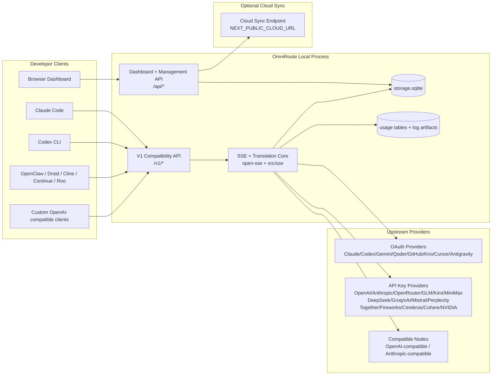
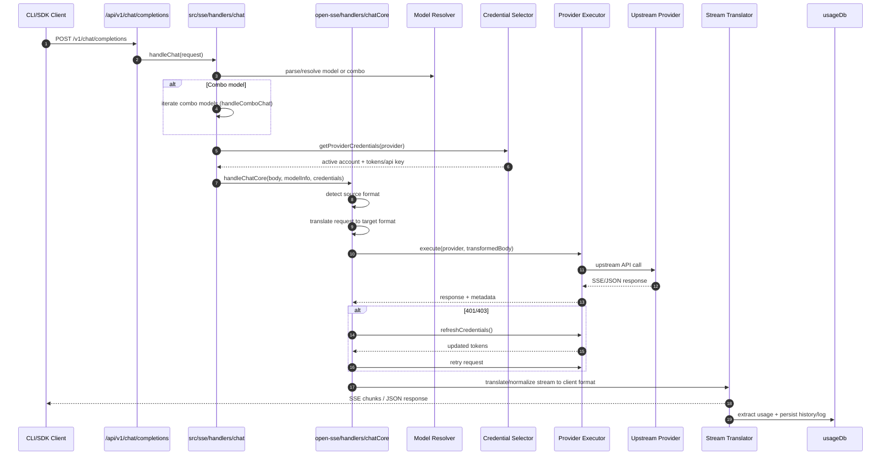
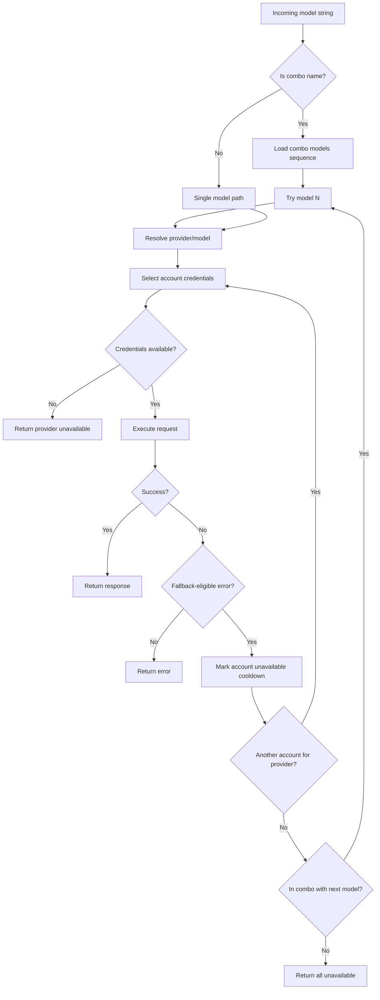
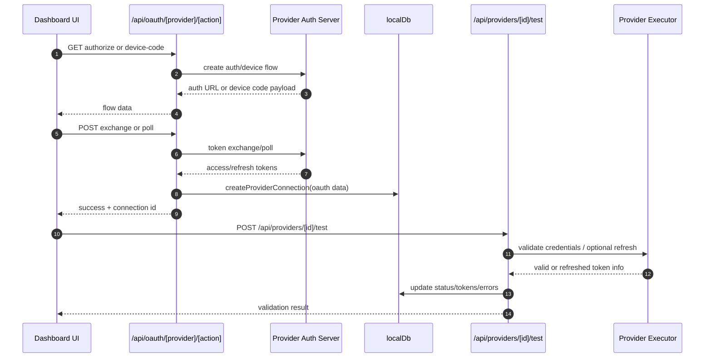
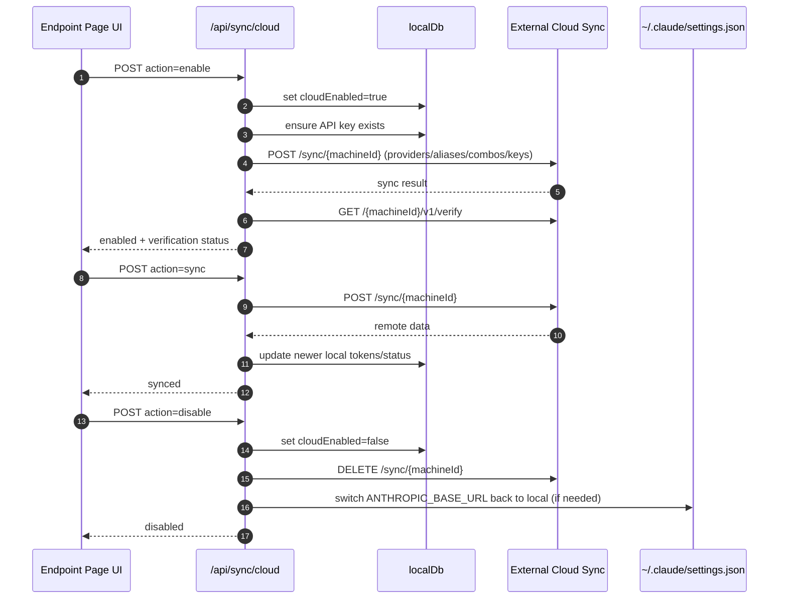
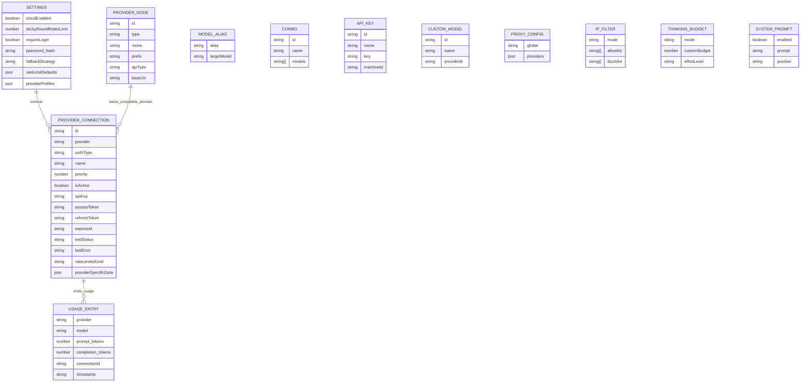
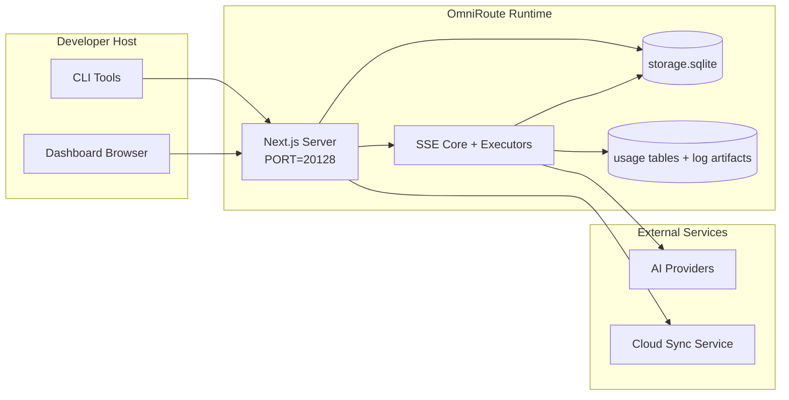

# Architektura OmniRoute

🌐 **Languages:** 🇺🇸 [English](./ARCHITECTURE.md) | 🇧🇷 [Português (Brasil)](../i18n/pt-BR/docs/architecture/ARCHITECTURE.md) | 🇪🇸 [Español](../i18n/es/docs/architecture/ARCHITECTURE.md) | 🇫🇷 [Français](../i18n/fr/docs/architecture/ARCHITECTURE.md) | 🇮🇹 [Italiano](../i18n/it/docs/architecture/ARCHITECTURE.md) | 🇷🇺 [Русский](../i18n/ru/docs/architecture/ARCHITECTURE.md) | 🇨🇳 [中文 (简体)](../i18n/zh-CN/docs/architecture/ARCHITECTURE.md) | 🇩🇪 [Deutsch](../i18n/de/docs/architecture/ARCHITECTURE.md) | 🇮🇳 [हिन्दी](../i18n/in/docs/architecture/ARCHITECTURE.md) | 🇹🇭 [ไทย](../i18n/th/docs/architecture/ARCHITECTURE.md) | 🇺🇦 [Українська](../i18n/uk-UA/docs/architecture/ARCHITECTURE.md) | 🇸🇦 [العربية](../i18n/ar/docs/architecture/ARCHITECTURE.md) | 🇯🇵 [日本語](../i18n/ja/docs/architecture/ARCHITECTURE.md) | 🇻🇳 [Tiếng Việt](../i18n/vi/docs/architecture/ARCHITECTURE.md) | 🇧🇬 [Български](../i18n/bg/docs/architecture/ARCHITECTURE.md) | 🇩🇰 [Dansk](../i18n/da/docs/architecture/ARCHITECTURE.md) | 🇫🇮 [Suomi](../i18n/fi/docs/architecture/ARCHITECTURE.md) | 🇮🇱 [עברית](../i18n/he/docs/architecture/ARCHITECTURE.md) | 🇭🇺 [Magyar](../i18n/hu/docs/architecture/ARCHITECTURE.md) | 🇮🇩 [Bahasa Indonesia](../i18n/id/docs/architecture/ARCHITECTURE.md) | 🇰🇷 [한국어](../i18n/ko/docs/architecture/ARCHITECTURE.md) | 🇲🇾 [Bahasa Melayu](../i18n/ms/docs/architecture/ARCHITECTURE.md) | 🇳🇱 [Nederlands](../i18n/nl/docs/architecture/ARCHITECTURE.md) | 🇳🇴 [Norsk](../i18n/no/docs/architecture/ARCHITECTURE.md) | 🇵🇹 [Português (Portugal)](../i18n/pt/docs/architecture/ARCHITECTURE.md) | 🇷🇴 [Română](../i18n/ro/docs/architecture/ARCHITECTURE.md) | 🇵🇱 [Polski](../i18n/pl/docs/architecture/ARCHITECTURE.md) | 🇸🇰 [Slovenčina](../i18n/sk/docs/architecture/ARCHITECTURE.md) | 🇸🇪 [Svenska](../i18n/sv/docs/architecture/ARCHITECTURE.md) | 🇵🇭 [Filipino](../i18n/phi/docs/architecture/ARCHITECTURE.md) | 🇨🇿 [Čeština](../i18n/cs/docs/architecture/ARCHITECTURE.md)

_Ostatnia aktualizacja: 2026-06-28_

## Podsumowanie wykonawcze

OmniRoute to lokalna brama routingu AI i panel (dashboard) zbudowane na Next.js.
Udostępnia pojedynczy endpoint zgodny z OpenAI (`/v1/*`) i kieruje ruch przez wielu dostawców upstream z tłumaczeniem, fallbackiem, odświeżaniem tokenów oraz śledzeniem użycia.

Główne możliwości:

- Powierzchnia API zgodna z OpenAI dla CLI/narzędzi (271 dostawców, 86 executorów)
- Tłumaczenie żądań/odpowiedzi między formatami dostawców
- Fallback combo modeli (sekwencja wielu modeli)
- Strukturalne kroki combo (`provider + model + connection`) z kolejnością runtime według `compositeTiers`
- Fallback na poziomie konta (wiele kont na dostawcę)
- Preflight limitu (quota) i wybór konta P2C uwzględniający quota na głównej ścieżce czatu
- Zarządzanie połączeniami dostawców OAuth + klucz API (19 modułów dostawców OAuth)
- Generowanie embeddingów przez `/v1/embeddings` (6 dostawców, 9 modeli)
- Generowanie obrazów przez `/v1/images/generations` (10+ dostawców, 20+ modeli)
- Transkrypcja audio przez `/v1/audio/transcriptions` (7 dostawców)
- Text-to-speech przez `/v1/audio/speech` (10 dostawców)
- Generowanie wideo przez `/v1/videos/generations` (ComfyUI + SD WebUI)
- Generowanie muzyki przez `/v1/music/generations` (ComfyUI)
- Wyszukiwanie w sieci przez `/v1/search` (5 dostawców)
- Moderacje przez `/v1/moderations`
- Reranking przez `/v1/rerank`
- Parsowanie tagów think (`<think>...</think>`) dla modeli reasoning
- Sanityzacja odpowiedzi pod ścisłą kompatybilność z OpenAI SDK
- Normalizacja ról (developer→system, system→user) dla kompatybilności między dostawcami
- Konwersja structured output (json_schema → Gemini responseSchema)
- Lokalna persystencja dostawców, kluczy, aliasów, combo, ustawień, cennika (26 modułów DB)
- Śledzenie użycia/kosztów i logowanie żądań
- Opcjonalna synchronizacja chmurowa dla wielu urządzeń/stanu
- Allowlista/blocklista IP do kontroli dostępu do API
- Zarządzanie thinking budget (passthrough/auto/custom/adaptive)
- Globalna injekcja system prompt
- Śledzenie sesji i fingerprinting
- Rozszerzone rate limiting per konto z profilami specyficznymi dla dostawcy
- Wzorzec circuit breaker dla odporności dostawców
- Ochrona anti-thundering herd z blokadą mutex
- Cache deduplikacji żądań oparty na sygnaturze
- Warstwa domenowa: reguły kosztów, polityka fallbacku, polityka lockout
- Context Relay: podsumowania handoff sesji dla ciągłości rotacji kont
- Persystencja stanu domeny (cache write-through SQLite dla fallbacków, budżetów, lockoutów, circuit breakerów)
- Silnik polityk do scentralizowanej oceny żądań (lockout → budget → fallback)
- Telemetria żądań z agregacją opóźnień p50/p95/p99
- Telemetria celów combo i historyczne zdrowie celów combo przez `combo_execution_key` / `combo_step_id`
- Correlation ID (X-Request-Id) do śledzenia end-to-end
- Logowanie audytu compliance z opt-out per klucz API
- Framework eval do zapewnienia jakości LLM
- Dashboard zdrowia ze statusem circuit breakerów dostawców w czasie rzeczywistym
- MCP Server (87 narzędzi) z 3 transportami (stdio/SSE/Streamable HTTP)
- A2A Server (JSON-RPC 2.0 + SSE) ze skillami i cyklem życia zadań
- System pamięci (ekstrakcja, injekcja, retrieval, summarization)
- System skilli (rejestr, executor, sandbox, wbudowane skille)
- Proxy MITM z zarządzaniem certyfikatami i obsługą DNS
- Middleware ochrony przed prompt injection
- Potok kompresji promptów z Caveman, RTK, stacked pipelines, compression combos, language packs i analityką
- Rejestr ACP (Agent Communication Protocol)
- Modularne dostawcy OAuth (19 osobnych modułów w `src/lib/oauth/providers/`)
- Skrypty uninstall/full-uninstall
- Akcja naprawy środowiska OAuth
- Most WebSocket dla klientów WS zgodnych z OpenAI (`/v1/ws`)
- Zarządzanie tokenami sync (issue/revoke, pobieranie pakietu konfiguracji wersjonowanego ETag)
- GLM Thinking (`glmt`) jako first-class preset dostawcy
- Hybrydowe liczenie tokenów (po stronie dostawcy `/messages/count_tokens` z fallbackiem estymacji)
- Auto-seeding aliasów modeli (30+ normalizacji dialektów cross-proxy przy starcie)
- Bezpieczny outbound fetch z ochroną SSRF, blokowaniem prywatnych URL i konfigurowalnym retry
- Ponowienia czatu uwzględniające cooldown z konfigurowalnym `requestRetry` i `maxRetryIntervalSec`
- Walidacja środowiska runtime Zod przy starcie
- Audyt compliance v2 z paginacją, zdarzeniami CRUD dostawców i logowaniem walidacji zablokowanej przez SSRF

Główny model runtime:

- Trasy aplikacji Next.js w `src/app/api/*` implementują zarówno API dashboardu, jak i API kompatybilności
- Współdzielony rdzeń SSE/routingu w `src/sse/*` + `open-sse/*` obsługuje wykonanie u dostawcy, tłumaczenie, streaming, fallback i użycie

## Diagramy referencyjne

Kanoniczne, wersjonowane źródła Mermaid platformy v3.8.0 znajdują się w
[`docs/diagrams/`](../diagrams/README.md). Dwa z nich są odtworzone poniżej dla orientacji;
pozostałe są linkowane z przewodników domenowych.


> Źródło: [diagrams/request-pipeline.mmd](../diagrams/request-pipeline.mmd)


> Źródło: [diagrams/resilience-3layers.mmd](../diagrams/resilience-3layers.mmd) — także linkowane z
> [RESILIENCE_GUIDE.md](./RESILIENCE_GUIDE.md) oraz referencji resilience w `CLAUDE.md`.

## Zakres i granice

### W zakresie

- Lokalny runtime bramy
- API zarządzania dashboardu
- Uwierzytelnianie dostawców i odświeżanie tokenów
- Tłumaczenie żądań i streaming SSE
- Lokalny stan + persystencja użycia
- Opcjonalna orkiestracja synchronizacji chmurowej

### Poza zakresem

- Implementacja usługi chmurowej za `NEXT_PUBLIC_CLOUD_URL`
- SLA/control plane dostawcy poza lokalnym procesem
- Same zewnętrzne binaria CLI (Claude CLI, Codex CLI itd.)

## Powierzchnia dashboardu (aktualna)

Główne strony w `src/app/(dashboard)/dashboard/`:

- `/dashboard` — szybki start + przegląd dostawców
- `/dashboard/endpoint` — zakładki proxy endpointu + MCP + A2A + API
- `/dashboard/providers` — połączenia dostawców i poświadczenia
- `/dashboard/combos` — strategie combo, szablony, builder krokowy, reguły routingu modeli, ręczna utrwalona kolejność
- `/dashboard/auto-combo` — Auto Combo Engine: wagi scoringu, mode packs, presetty virtual factory, telemetria
- `/dashboard/costs` — agregacja kosztów i widoczność cennika
- `/dashboard/analytics` — analityka użycia, ewaluacje, zdrowie celów combo
- `/dashboard/limits` — kontrole quota/rate
- `/dashboard/cli-tools` — onboarding CLI, detekcja runtime, generowanie konfiguracji
- `/dashboard/agents` — wykryte agenty ACP + rejestracja niestandardowych agentów
- `/dashboard/cloud-agents` — zadania agentów hostowanych w chmurze (Codex Cloud, Devin, Jules) i cykl życia zadań
- `/dashboard/skills` — rejestr skilli A2A, wykonanie w sandboxie, katalog wbudowanych skilli
- `/dashboard/memory` — podgląd i retrieval trwałej pamięci konwersacyjnej
- `/dashboard/webhooks` — subskrypcje webhooków wychodzących, rotacja sekretów, statystyki retry
- `/dashboard/batch` — składanie zadań batch i postęp
- `/dashboard/cache` — statystyki read-through i reasoning cache, kontrola eviction
- `/dashboard/playground` — interaktywny playground czatu wobec dowolnego skonfigurowanego combo/modelu
- `/dashboard/changelog` — przeglądarka changelog w aplikacji (renderuje `CHANGELOG.md`)
- `/dashboard/system` — diagnostyka runtime, info o wersji, powierzchnia walidacji środowiska
- `/dashboard/onboarding` — kreator pierwszej konfiguracji dla nowych instalacji
- `/dashboard/media` — playground obraz/wideo/muzyka
- `/dashboard/search-tools` — testowanie dostawców wyszukiwania i historia
- `/dashboard/health` — uptime, circuit breakery, rate limity, sesje monitorowane pod kątem quota
- `/dashboard/logs` — logi request/proxy/audit/console
- `/dashboard/settings` — zakładki ustawień systemowych (ogólne, routing, domyślne combo itd.)
- `/dashboard/context/caveman` — reguły kompresji Caveman, language packs, preview i tryb wyjścia
- `/dashboard/context/rtk` — filtry wyjścia poleceń RTK, preview i ustawienia bezpieczeństwa runtime
- `/dashboard/context/combos` — nazwane potoki kompresji przypisane do combo routingu
- `/dashboard/translator` — podgląd translatora i preview konwersji formatu żądania
- `/dashboard/audit` — przeglądarka logu audytu compliance z paginacją i ustrukturyzowanymi metadanymi
- `/dashboard/usage` — przeglądarka użycia per żądanie powiązana z `usage_history`
- `/dashboard/compression` — analityka kompresji, statystyki i przypisanie potoku
- `/dashboard/api-manager` — cykl życia kluczy API i uprawnienia modeli

## Kontekst systemu wysokiego poziomu



## Główne komponenty runtime

## 1) Warstwa API i routingu (Next.js App Routes)

Główne katalogi:

- `src/app/api/v1/*` oraz `src/app/api/v1beta/*` dla API kompatybilności
- `src/app/api/*` dla API zarządzania/konfiguracji
- Rewrite Next w `next.config.mjs` mapują `/v1/*` na `/api/v1/*`

Ważne trasy kompatybilności:

- `src/app/api/v1/chat/completions/route.ts`
- `src/app/api/v1/messages/route.ts`
- `src/app/api/v1/responses/route.ts`
- `src/app/api/v1/models/route.ts` — obejmuje modele niestandardowe z `custom: true`
- `src/app/api/v1/embeddings/route.ts` — generowanie embeddingów (6 dostawców)
- `src/app/api/v1/images/generations/route.ts` — generowanie obrazów (4+ dostawców w tym Antigravity/Nebius)
- `src/app/api/v1/messages/count_tokens/route.ts`
- `src/app/api/v1/providers/[provider]/chat/completions/route.ts` — dedykowany chat per dostawca
- `src/app/api/v1/providers/[provider]/embeddings/route.ts` — dedykowane embeddingi per dostawca
- `src/app/api/v1/providers/[provider]/images/generations/route.ts` — dedykowane obrazy per dostawca
- `src/app/api/v1beta/models/route.ts`
- `src/app/api/v1beta/models/[...path]/route.ts`

Domeny zarządzania:

- Auth/ustawienia: `src/app/api/auth/*`, `src/app/api/settings/*`
- Dostawcy/połączenia: `src/app/api/providers*`
- Węzły dostawców: `src/app/api/provider-nodes*`
- Modele niestandardowe: `src/app/api/provider-models` (GET/POST/DELETE)
- Katalog modeli: `src/app/api/models/route.ts` (GET)
- Konfiguracja proxy: `src/app/api/settings/proxy` (GET/PUT/DELETE) + `src/app/api/settings/proxy/test` (POST)
- OAuth: `src/app/api/oauth/*`
- Klucze/aliasy/combo/cennik: `src/app/api/keys*`, `src/app/api/models/alias`, `src/app/api/combos*`, `src/app/api/pricing`
- Użycie: `src/app/api/usage/*`
- Sync/chmura: `src/app/api/sync/*`, `src/app/api/cloud/*`
- Pomocnicze narzędzia CLI: `src/app/api/cli-tools/*`
- Filtr IP: `src/app/api/settings/ip-filter` (GET/PUT)
- Thinking budget: `src/app/api/settings/thinking-budget` (GET/PUT)
- System prompt: `src/app/api/settings/system-prompt` (GET/PUT)
- Kompresja: `src/app/api/settings/compression`, `src/app/api/compression/*` oraz
  `src/app/api/context/*`
- Sesje: `src/app/api/sessions` (GET)
- Rate limity: `src/app/api/rate-limits` (GET)
- Resilience: `src/app/api/resilience` (GET/PATCH) — kolejka żądań, cooldown połączenia, provider breaker, konfiguracja wait-for-cooldown
- Reset resilience: `src/app/api/resilience/reset` (POST) — reset breakerów dostawców
- Statystyki cache: `src/app/api/cache/stats` (GET/DELETE)
- Telemetria: `src/app/api/telemetry/summary` (GET)
- Budżet: `src/app/api/usage/budget` (GET/POST)
- Łańcuchy fallback: `src/app/api/fallback/chains` (GET/POST/DELETE)
- Audyt compliance: `src/app/api/compliance/audit-log` (GET, z paginacją + ustrukturyzowanymi metadanymi)
- Evale: `src/app/api/evals` (GET/POST), `src/app/api/evals/[suiteId]` (GET)
- Polityki: `src/app/api/policies` (GET/POST)
- Tokeny sync: `src/app/api/sync/tokens` (GET/POST), `src/app/api/sync/tokens/[id]` (GET/DELETE)
- Pakiet konfiguracji: `src/app/api/sync/bundle` (GET, snapshot settings/providers/combos/keys wersjonowany ETag)
- WebSocket: `src/app/api/v1/ws/route.ts` — handler Upgrade dla klientów WS zgodnych z OpenAI

## 2) Rdzeń SSE + tłumaczenia

Główne moduły przepływu:

- Wejście: `src/sse/handlers/chat.ts`
- Orkiestracja rdzenia: `open-sse/handlers/chatCore.ts`
- Adaptery wykonania dostawców: `open-sse/executors/*`
- Detekcja formatu/konfiguracja dostawcy: `open-sse/services/provider.ts`
- Parsowanie/rozwiązywanie modelu: `src/sse/services/model.ts`, `open-sse/services/model.ts`
- Logika fallbacku kont: `open-sse/services/accountFallback.ts`
- Rejestr tłumaczeń: `open-sse/translator/index.ts`
- Transformacje strumienia: `open-sse/utils/stream.ts`, `open-sse/utils/streamHandler.ts`
- Ekstrakcja/normalizacja użycia: `open-sse/utils/usageTracking.ts`
- Parser tagów think: `open-sse/utils/thinkTagParser.ts`
- Handler embeddingów: `open-sse/handlers/embeddings.ts`
- Rejestr dostawców embeddingów: `open-sse/config/embeddingRegistry.ts`
- Handler generowania obrazów: `open-sse/handlers/imageGeneration.ts`
- Rejestr dostawców obrazów: `open-sse/config/imageRegistry.ts`
- Sanityzacja odpowiedzi: `open-sse/handlers/responseSanitizer.ts`
- Normalizacja ról: `open-sse/services/roleNormalizer.ts`

Usługi (logika biznesowa):

- Wybór/scoring kont: `open-sse/services/accountSelector.ts`
- Zarządzanie cyklem życia kontekstu: `open-sse/services/contextManager.ts`
- Egzekwowanie filtra IP: `open-sse/services/ipFilter.ts`
- Śledzenie sesji: `open-sse/services/sessionManager.ts`
- Deduplikacja żądań: `open-sse/services/signatureCache.ts`
- Injekcja system prompt: `open-sse/services/systemPrompt.ts`
- Zarządzanie thinking budget: `open-sse/services/thinkingBudget.ts`
- Routing modeli wildcard: `open-sse/services/wildcardRouter.ts`
- Zarządzanie rate limit: `open-sse/services/rateLimitManager.ts`
- Circuit breaker: `src/shared/utils/circuitBreaker.ts`
- Context handoff: `open-sse/services/contextHandoff.ts` — generowanie i injekcja podsumowania handoff dla strategii context-relay
- Kompresja: `open-sse/services/compression/*` — proaktywna kompresja przed tłumaczeniem dostawcy;
  obejmuje reguły Caveman, filtry RTK, stacked pipelines, compression combos, stats i walidację
- Fetcher quota Codex: `open-sse/services/codexQuotaFetcher.ts` — pobiera quota Codex na decyzje handoff context-relay
- Retry uwzględniający cooldown: `src/sse/services/cooldownAwareRetry.ts` — retry cooldown per model z konfigurowalnym `requestRetry` / `maxRetryIntervalSec`
- Bezpieczny outbound fetch: `src/shared/network/safeOutboundFetch.ts` — strzeżony fetch dostawcy/modelu z ochroną SSRF, blokowaniem prywatnych URL, retry i timeoutem
- Guard URL outbound: `src/shared/network/outboundUrlGuard.ts` — waliduje URL dostawców względem prywatnych/localhost zakresów CIDR
- Domyślne żądania dostawcy: `open-sse/services/providerRequestDefaults.ts` — domyślne na poziomie dostawcy `maxTokens`, `temperature`, `thinkingBudgetTokens`
- Stałe dostawcy GLM: `open-sse/config/glmProvider.ts` — współdzielone modele GLM, URL quota, timeout/domyślne GLMT
- Upstream Antigravity: `open-sse/config/antigravityUpstream.ts` — stałe base URL i ścieżki discovery
- Stałe klienta Codex: `open-sse/config/codexClient.ts` — wersjonowany user-agent i wartości client-version
- Seed aliasów modeli: `src/lib/modelAliasSeed.ts` — seeduje 30+ aliasów dialektów cross-proxy przy starcie

Moduły warstwy domenowej:

- Reguły kosztów/budżety: `src/domain/costRules.ts`
- Polityka fallbacku: `src/domain/fallbackPolicy.ts`
- Resolver combo: `src/domain/comboResolver.ts`
- Polityka lockout: `src/domain/lockoutPolicy.ts`
- Silnik polityk: `src/domain/policyEngine.ts` — scentralizowana ocena lockout → budget → fallback
- Katalog kodów błędów: `src/shared/constants/errorCodes.ts`
- Request ID: `src/shared/utils/requestId.ts`
- Timeout fetch: `src/shared/utils/fetchTimeout.ts`
- Telemetria żądań: `src/shared/utils/requestTelemetry.ts`
- Compliance/audyt: `src/lib/compliance/index.ts`
- Runner eval: `src/lib/evals/evalRunner.ts`
- Persystencja stanu domeny: `src/lib/db/domainState.ts` — CRUD SQLite dla łańcuchów fallback, budżetów, historii kosztów, stanu lockout, circuit breakerów

Moduły dostawców OAuth (16 osobnych plików w `src/lib/oauth/providers/`):

- Indeks rejestru: `src/lib/oauth/providers/index.ts`
- Poszczególni dostawcy: `claude.ts`, `codex.ts`, `gemini.ts`, `antigravity.ts`, `agy.ts`, `qoder.ts`, `qwen.ts`, `kimi-coding.ts`, `github.ts`, `kiro.ts`, `cursor.ts`, `kilocode.ts`, `cline.ts`, `windsurf.ts`, `gitlab-duo.ts`, `trae.ts`
- Cienki wrapper: `src/lib/oauth/providers.ts` — re-eksport z poszczególnych modułów

## 5) Osadzone usługi (v3.8.4)

OmniRoute może instalować, nadzorować i routować do lokalnie działających procesów narzędzi AI
nazywanych **embedded services**. W v3.8.4 dostarczone są dwa: 9Router i CLIProxyAPI.

Warstwy architektury:

- **UI** (`/dashboard/providers/services`) — strona z dwiema zakładkami, kontrolami cyklu życia,
  strumieniowaniem logów na żywo, zarządzaniem kluczami API oraz (dla 9Router) osadzonym natywnym UI przez
  wewnętrzne reverse proxy.
- **API** (`/api/services/{name}/*`) — 8 endpointów dla 9Router, 7 dla CLIProxyAPI,
  wszystkie sklasyfikowane jako **LOCAL_ONLY** (twarda reguła #17). Współdzielony `GET /api/services/[name]/logs`
  endpoint SSE obsługuje obie usługi.
- **Supervisor** (`src/lib/services/`) — generyczna klasa `ServiceSupervisor` owija
  `child_process.spawn`, trzyma ring buffer 5 MB dla strumieniowania logów SSE, pętlę health
  probe, atomową blokadę operacji oraz graceful shutdown SIGTERM→SIGKILL.
  `bootstrap.ts` podłącza wszystkie skonfigurowane usługi przy starcie procesu.
- **Provider/executor** (`open-sse/executors/ninerouter.ts`) — 9Router jest eksponowany jako
  prawdziwy dostawca. Modele mają prefiks `9router/{sub}/{model}` i są synchronizowane co 5 min
  z endpointu `/v1/models` 9Router.

Szczegóły: `docs/frameworks/EMBEDDED-SERVICES.md`

## Główne podsystemy (v3.8.0)

### A. Auto Combo Engine

Auto Combo dynamicznie scoruje i wybiera cele routingu w czasie żądania, zamiast
polegać na statycznej definicji combo. Napędza rodzinę prefiksów modeli `auto/*`.

- Wejście silnika: `open-sse/services/autoCombo/` (`autoComboEngine.ts`,
  `scoringEngine.ts`, `virtualFactory.ts`, `modePacks.ts`)
- Resolver: `src/domain/comboResolver.ts` (auto-detekcja prefiksu `auto/`)
- Dashboard: `/dashboard/auto-combo`
- Telemetria: tabela SQLite `auto_combo_decisions`

Kluczowe możliwości:

- **17 strategii routingu** (priority, weighted, fill-first, round-robin, P2C, random,
  least-used, cost-optimized, reset-aware, reset-window, headroom, strict-random,
  **auto**, lkgp, context-optimized, context-relay, **fusion**, plus ścieżka fallback) —
  auto to główna nowość w v3.8.0; `fusion` (panel fan-out + synteza sędziego,
  `open-sse/services/fusion.ts`) jest nowe w v3.8.36.
- **Scoring 9-czynnikowy**: koszt, latency p95, success rate, quota headroom, bliskość
  lockout, stan breakera, niedawne błędy, dostępność modelu oraz tag affinity.
- **Virtual factory** materializuje efemeryczne combo, gdy nie istnieje pasujące nazwane combo,
  czerpiąc kandydatów ze zdrowych aktywnych połączeń dostawców.
- **Prefiksy auto**: `auto/coding`, `auto/cheap`, `auto/fast`, `auto/offline`,
  `auto/smart`, `auto/lkgp` — każdy oparty na dostrojonym profilu wag.
- **4 mode packs**: coding, fast, cheap, smart — dostarczone jako presetowe
  konfiguracje wag wywoływane z dashboardu.

Pełne szczegóły algorytmiczne (formuły czynników, strojenie wag): zob.
[`docs/routing/AUTO-COMBO.md`](../routing/AUTO-COMBO.md).

### B. Cloud Agents

Cloud Agents owija zewnętrzne hostowane platformy code-agent (Codex Cloud, Devin,
Jules) za jednolitym cyklem życia zadań opartym na DB. Wszystkie endpointy tworzenia/inspekcji
zadań wymagają uwierzytelnienia management.

- Korzeń modułu: `src/lib/cloudAgent/` (`baseAgent.ts`, `registry.ts`, `api.ts`,
  `types.ts`, `db.ts`, plus podkatalogi per agent w `agents/`)
- Implementacje per agent: `agents/codex/`, `agents/devin/`, `agents/jules/`
- Publiczne endpointy: `/api/v1/agents/tasks/*` (list/create/get/cancel)
- Endpointy management: `/api/cloud/*` (provisioning, status, batch)
- Dashboard: `/dashboard/cloud-agents`
- Magazyn: tabela `cloud_agent_tasks`

Szczegóły provisioningu i OAuth per agent: zob.
[`docs/frameworks/CLOUD_AGENT.md`](../frameworks/CLOUD_AGENT.md).

### C. Guardrails

Moduł guardrails to hot-reloadowalna warstwa middleware, która inspectuje żądania
i odpowiedzi pod kątem PII, prompt injection oraz niebezpiecznej treści vision. Naruszenia
przerywają żądanie kodem HTTP **503** oraz ustrukturyzowanym kodem błędu, pozwalając
downstream callerom na retry lub branch.

- Korzeń modułu: `src/lib/guardrails/` (`base.ts`, `registry.ts`, `piiMasker.ts`,
  `promptInjection.ts`, `visionBridge.ts`, `visionBridgeHelpers.ts`)
- Hot reload: rejestr obserwuje zmiany konfiguracji i przebudowuje łańcuch w miejscu
- Punkty podłączenia: wejście handlera czatu, handler generowania obrazów, sanitizer odpowiedzi
- Kontrakt HTTP: naruszenia jako `503` z `error.code = "GUARDRAIL_VIOLATION"`

Tworzenie rulesetów i strojenie progów: zob.
[`docs/security/GUARDRAILS.md`](../security/GUARDRAILS.md).

### D. Warstwa domenowa

Przestrzeń nazw `src/domain/` centralizuje decyzje polityk, aby handlery tras nie musiały
same składać logiki lockout/budget/fallback.

- Silnik polityk: `src/domain/policyEngine.ts` — pojedynczy punkt wejścia dla
  oceny przed wykonaniem (kolejność lockout → budget → fallback)
- Reguły kosztów: `src/domain/costRules.ts`
- Polityka fallbacku: `src/domain/fallbackPolicy.ts`
- Polityka lockout: `src/domain/lockoutPolicy.ts`
- Routing oparty na tagach: `src/domain/tagRouter.ts`
- Resolver combo: `src/domain/comboResolver.ts` — rozwiązuje nazwy combo, prefiksy auto/\*,
  oraz cele modeli wildcard do konkretnych planów wykonania
- Joiner reguł connection/model: `src/domain/connectionModelRules.ts`
- Snapshoty dostępności modeli: `src/domain/modelAvailability.ts`
- Śledzenie wygaśnięcia dostawców: `src/domain/providerExpiration.ts`
- Cache quota: `src/domain/quotaCache.ts`
- Stan degradacji: `src/domain/degradation.ts`
- Audyt konfiguracji: `src/domain/configAudit.ts`
- Builder metadanych odpowiedzi OmniRoute: `src/domain/omnirouteResponseMeta.ts`
- Podsystem assessment: `src/domain/assessment/` — okresowe zadania ewaluacji

### E. Potok autoryzacji

Potok autoryzacji klasyfikuje każde przychodzące żądanie i stosuje
odpowiedni łańcuch polityk przed dispatch.

- Wejście potoku: `src/server/authz/pipeline.ts`
- Klasyfikator żądań: `src/server/authz/classify.ts` — rozróżnia publiczne
  trasy kompatybilności od tras management
- Inwentarz tras publicznych: `src/shared/constants/publicApiRoutes.ts`
- Polityki: `src/server/authz/policies/` — składalne predykaty
  (`requireApiKey`, `requireManagement`, `requireFreshAuth` itd.)
- Narzędzia nagłówków: `src/server/authz/headers.ts`
- Helper asercji: `src/server/authz/assertAuth.ts`
- Kontekst żądania: `src/server/authz/context.ts`

Trasy publiczne vs management to twarda granica: API agent/cooldown oraz
mutacje dostawców wymagają auth management (HTTP 401 przy braku).

Pełne reguły klasyfikacji tras: zob.
[`docs/architecture/AUTHZ_GUIDE.md`](./AUTHZ_GUIDE.md).

### F. Workflow FSM i Task-Aware Router

Router oparty na maszynie stanów (FSM) warstwowo nad wyborem combo, aby kierować
ruch na podstawie wykrytego etapu workflow (planning, execution,
review) oraz affinity zadań w tle.

- Workflow FSM: `open-sse/services/workflowFSM.ts`
- Task-aware router: `open-sse/services/taskAwareRouter.ts`
- Detektor zadań w tle: `open-sse/services/backgroundTaskDetector.ts`
- Klasyfikator intencji: `open-sse/services/intentClassifier.ts`

Przejścia FSM zasilają scoring Auto Combo, faworyzując tańsze modele
dla zadań background/automation oraz silniejsze modele dla interaktywnych
tur planning/review.

### G. Odporność specyficzna dla dostawcy

Kilku dostawców dostarcza dedykowane moduły resilience i stealth, które opierają się na
globalnych warstwach circuit breaker / connection cooldown / model lockout:

- Silnik Antigravity 429: `open-sse/services/antigravity429Engine.ts` (rotuje
  tożsamość, czyści nagłówki odpowiedzi, napędza śledzenie credits/version przez
  `antigravityCredits.ts`, `antigravityHeaderScrub.ts`, `antigravityHeaders.ts`,
  `antigravityIdentity.ts`, `antigravityVersion.ts`)
- Polityka quota ModelScope: `open-sse/services/modelscopePolicy.ts`
- Claude Code CCH (Compatibility Channel Handshake): `open-sse/services/claudeCodeCCH.ts`,
  plus `claudeCodeCompatible.ts`, `claudeCodeConstraints.ts`, `claudeCodeExtraRemap.ts`,
  `claudeCodeToolRemapper.ts`
- Kształtowanie fingerprint Claude Code: `open-sse/services/claudeCodeFingerprint.ts`
- Obfuskacja Claude Code: `open-sse/services/claudeCodeObfuscation.ts`
- Klient TLS ChatGPT: `open-sse/services/chatgptTlsClient.ts` (styl curl-impersonate
  dla sesji ChatGPT-Web)
- Cache obrazów ChatGPT: `open-sse/services/chatgptImageCache.ts`

Pełny playbook stealth i wskazówki operacyjne: zob.
[`docs/security/STEALTH_GUIDE.md`](../security/STEALTH_GUIDE.md).

### H. Webhooks, Reasoning Cache, Read Cache

- **Webhooks** — wychodzący dispatch zdarzeń provider/account/task.
  - Dispatcher: `src/lib/webhookDispatcher.ts`
  - Magazyn: tabela SQLite `webhooks` (przez `src/lib/db/webhooks.ts`)
  - Dashboard: `/dashboard/webhooks` (subskrypcje, sekrety, historia retry)
  - Taksonomia zdarzeń i semantyka retry: zob. [`docs/frameworks/WEBHOOKS.md`](../frameworks/WEBHOOKS.md).
- **Reasoning Cache** — odtwarzalne bloki reasoning dla dostawców emitujących
  thinking tokens (Claude, GLMT itd.), aby kolejne tury mogły pominąć ponowne myślenie.
  - Warstwa DB: `src/lib/db/reasoningCache.ts`
  - Warstwa usług: `open-sse/services/reasoningCache.ts`
  - Semantyka replay: zob. [`docs/routing/REASONING_REPLAY.md`](../routing/REASONING_REPLAY.md).
- **Read Cache** — krótkotrwały cache odpowiedzi kluczowany sygnaturą, używany do
  zwijania identycznych retry ze zepsutych upstream SDK.
  - Warstwa DB: `src/lib/db/readCache.ts`
  - Endpoint statystyk: `GET /api/cache/stats`, dashboard pod `/dashboard/cache`

## 3) Warstwa persystencji

Główna baza stanu (SQLite):

- Infrastruktura rdzenia: `src/lib/db/core.ts` (better-sqlite3, migracje, WAL)
- Fasada re-eksportu: `src/lib/localDb.ts` (cienka warstwa kompatybilności dla callerów)
- plik: `${DATA_DIR}/storage.sqlite` (lub `$XDG_CONFIG_HOME/omniroute/storage.sqlite` gdy ustawione, w przeciwnym razie `~/.omniroute/storage.sqlite`)
- encje (tabele + przestrzenie KV): providerConnections, providerNodes, modelAliases, combos, apiKeys, settings, pricing, **customModels**, **proxyConfig**, **ipFilter**, **thinkingBudget**, **systemPrompt**

Persystencja użycia:

- fasada: `src/lib/usageDb.ts` (zdekomponowane moduły w `src/lib/usage/*`)
- Tabele SQLite w `storage.sqlite`: `usage_history`, `call_logs`, `proxy_logs`
- opcjonalne artefakty plikowe pozostają dla kompatybilności/debug (`${DATA_DIR}/log.txt`, `${DATA_DIR}/call_logs/`, `<repo>/logs/...`)
- legacy pliki JSON są migrowane do SQLite przez migracje startowe, gdy są obecne

DB stanu domeny (SQLite):

- `src/lib/db/domainState.ts` — operacje CRUD dla stanu domeny
- Tabele (tworzone w `src/lib/db/core.ts`): `domain_fallback_chains`, `domain_budgets`, `domain_cost_history`, `domain_lockout_state`, `domain_circuit_breakers`
- Wzorzec cache write-through: in-memory Maps są autorytatywne w runtime; mutacje zapisywane synchronicznie do SQLite; stan przywracany z DB przy cold start

## 4) Powierzchnie Auth + Security

- Auth cookie dashboardu: `src/proxy.ts`, `src/app/api/auth/login/route.ts`
- Generowanie/weryfikacja kluczy API: `src/shared/utils/apiKey.ts`
- Sekrety dostawców utrwalane w wpisach `providerConnections`
- Wsparcie outbound proxy przez `open-sse/utils/proxyFetch.ts` (zmienne env) oraz `open-sse/utils/networkProxy.ts` (konfigurowalne per dostawca lub globalnie)
- Guard SSRF / URL outbound: `src/shared/network/outboundUrlGuard.ts` — blokuje zakresy private/loopback/link-local dla wszystkich wywołań dostawców
- Walidacja env runtime: `src/lib/env/runtimeEnv.ts` — schemat Zod dla wszystkich zmiennych środowiskowych, jako błędy/ostrzeżenia startowe
- Tokeny sync: `src/lib/db/syncTokens.ts` — tokeny o zakresie dla endpointów pobierania pakietu konfiguracji; oparte na tabeli SQLite `sync_tokens` (migracja `024_create_sync_tokens.sql`)
- Auth handshake WebSocket: `src/lib/ws/handshake.ts` — waliduje żądania upgrade WS przez klucz API lub cookie sesji

## 5) Synchronizacja chmurowa

- Inicjalizacja schedulera: `src/lib/initCloudSync.ts`, `src/shared/services/initializeCloudSync.ts`, `src/shared/services/modelSyncScheduler.ts`
- Zadanie okresowe: `src/shared/services/cloudSyncScheduler.ts`
- Zadanie okresowe: `src/shared/services/modelSyncScheduler.ts`
- Trasa sterująca: `src/app/api/sync/cloud/route.ts`

## Cykl życia żądania (`/v1/chat/completions`)



## Przepływ fallback combo + konta



Decyzje fallbacku napędza `open-sse/services/accountFallback.ts` na podstawie kodów statusu i heurystyk komunikatów błędów. Routing combo dodaje dodatkową ochronę: 400 w zakresie dostawcy, takie jak błędy content-block upstream i walidacji ról, są traktowane jako lokalne błędy modelu, aby późniejsze cele combo mogły nadal działać.

## Cykl życia onboardingu OAuth i odświeżania tokenów



Odświeżanie podczas żywego ruchu jest wykonywane w `open-sse/handlers/chatCore.ts` przez `refreshCredentials()` executora.

## Cykl życia Cloud Sync (Enable / Sync / Disable)



Okresowa synchronizacja jest uruchamiana przez `CloudSyncScheduler`, gdy chmura jest włączona.

## Model danych i mapa magazynu



Fizyczne pliki magazynu:

- główna DB runtime: `${DATA_DIR}/storage.sqlite`
- linie logu żądań: `${DATA_DIR}/log.txt` (artefakt kompatybilności/debug)
- archiwa ustrukturyzowanych payloadów wywołań: `${DATA_DIR}/call_logs/`
- opcjonalne sesje debug translatora/żądań: `<repo>/logs/...`

## Topologia wdrożenia



## Mapowanie modułów (krytyczne dla decyzji)

### Moduły tras i API

- `src/app/api/v1/*`, `src/app/api/v1beta/*`: API kompatybilności
- `src/app/api/v1/providers/[provider]/*`: dedykowane trasy per dostawca (chat, embeddings, images)
- `src/app/api/providers*`: CRUD dostawców, walidacja, testowanie
- `src/app/api/provider-nodes*`: zarządzanie niestandardowymi węzłami kompatybilnymi
- `src/app/api/provider-models`: zarządzanie modelami niestandardowymi (CRUD)
- `src/app/api/models/route.ts`: API katalogu modeli (aliasy + modele niestandardowe)
- `src/app/api/oauth/*`: przepływy OAuth/device-code
- `src/app/api/keys*`: cykl życia lokalnych kluczy API
- `src/app/api/models/alias`: zarządzanie aliasami
- `src/app/api/combos*`: zarządzanie combo fallback
- `src/app/api/pricing`: nadpisania cennika do kalkulacji kosztów
- `src/app/api/settings/proxy`: konfiguracja proxy (GET/PUT/DELETE)
- `src/app/api/settings/proxy/test`: test łączności outbound proxy (POST)
- `src/app/api/usage/*`: API użycia i logów
- `src/app/api/sync/*` + `src/app/api/cloud/*`: cloud sync i pomocnicze API chmurowe
- `src/app/api/cli-tools/*`: lokalne writers/checkers konfiguracji CLI
- `src/app/api/settings/ip-filter`: allowlista/blocklista IP (GET/PUT)
- `src/app/api/settings/thinking-budget`: konfiguracja budżetu tokenów thinking (GET/PUT)
- `src/app/api/settings/system-prompt`: globalny system prompt (GET/PUT)
- `src/app/api/settings/compression`: globalne ustawienia kompresji (GET/PUT)
- `src/app/api/compression/*`: preview kompresji, metadane reguł i language packs
- `src/app/api/context/caveman/config`: alias ustawień Caveman (GET/PUT)
- `src/app/api/context/rtk/*`: konfiguracja RTK, katalog filtrów, endpoint testowy i odzyskiwanie raw-output
- `src/app/api/context/combos*`: CRUD compression combo i przypisania routing-combo
- `src/app/api/context/analytics`: alias analityki kompresji
- `src/app/api/sessions`: lista aktywnych sesji (GET)
- `src/app/api/rate-limits`: status rate limit per konto (GET)
- `src/app/api/sync/tokens`: CRUD tokenów sync (GET/POST)
- `src/app/api/sync/tokens/[id]`: get/delete tokenu sync (GET/DELETE)
- `src/app/api/sync/bundle`: pobieranie pakietu konfiguracji (GET, wersjonowanie ETag)
- `src/app/api/v1/ws`: handler upgrade WebSocket dla klientów WS zgodnych z OpenAI

### Rdzeń routingu i wykonania

- `src/sse/handlers/chat.ts`: parse żądania, obsługa combo, pętla wyboru konta
- `open-sse/handlers/chatCore.ts`: tłumaczenie, dispatch executora, obsługa retry/refresh, setup strumienia
- `open-sse/executors/*`: zachowanie sieciowe i formatowe specyficzne dla dostawcy

### Rejestr tłumaczeń i konwertery formatów

- `open-sse/translator/index.ts`: rejestr translatora i orkiestracja
- Translatory żądań: `open-sse/translator/request/*` (9 modułów — `antigravity-to-openai`, `claude-to-gemini`, `claude-to-openai`, `gemini-to-openai`, `openai-responses`, `openai-to-claude`, `openai-to-cursor`, `openai-to-gemini`, `openai-to-kiro`)
- Translatory odpowiedzi: `open-sse/translator/response/*` (8 modułów — `claude-to-openai`, `cursor-to-openai`, `gemini-to-claude`, `gemini-to-openai`, `kiro-to-openai`, `openai-responses`, `openai-to-antigravity`, `openai-to-claude`)
- Helpery: `open-sse/translator/helpers/*` (8 modułów — `claudeHelper`, `geminiHelper`, `geminiToolsSanitizer`, `maxTokensHelper`, `openaiHelper`, `responsesApiHelper`, `schemaCoercion`, `toolCallHelper`)
- Stałe formatów: `open-sse/translator/formats.ts`
- Bootstrap i rejestr: `open-sse/translator/bootstrap.ts`, `open-sse/translator/registry.ts`
- Helpery formatu obrazów: `open-sse/translator/image/`

### Persystencja

- `src/lib/db/*`: trwała konfiguracja/stan i persystencja domeny na SQLite
- `src/lib/localDb.ts`: re-eksport kompatybilności dla modułów DB
- `src/lib/usageDb.ts`: fasada historii użycia/call logs nad tabelami SQLite

## Pokrycie executorów dostawców (Strategy Pattern)

Każdy dostawca ma wyspecjalizowany executor rozszerzający `BaseExecutor` (w `open-sse/executors/base.ts`), który zapewnia budowanie URL, konstrukcję nagłówków, retry z exponential backoff, hooki odświeżania poświadczeń oraz metodę orkiestracji `execute()`.

| Executor                 | Provider(s)                                                                                                                                                 | Specjalna obsługa                                                          |
| ------------------------ | ----------------------------------------------------------------------------------------------------------------------------------------------------------- | -------------------------------------------------------------------------- |
| `DefaultExecutor`        | OpenAI, Claude, Gemini, Qwen, OpenRouter, GLM, Kimi, MiniMax, DeepSeek, Groq, xAI, Mistral, Perplexity, Together, Fireworks, Cerebras, Cohere, NVIDIA, etc. | Dynamiczna konfiguracja URL/nagłówków per dostawca                         |
| `AntigravityExecutor`    | Google Antigravity                                                                                                                                          | Niestandardowe ID project/session, parsowanie Retry-After, obfuskacja 429  |
| `AzureOpenAIExecutor`    | Azure OpenAI                                                                                                                                                | Routing oparty na deployment, egzekwowanie query api-version               |
| `BlackboxWebExecutor`    | Blackbox AI (web-mode)                                                                                                                                      | Reverse sesji web z emulacją fingerprint TLS                               |
| `ChatGPTWebExecutor`     | ChatGPT web                                                                                                                                                 | Klient TLS + zarządzanie cookie sesji (`chatgptTlsClient.ts`)              |
| `ClaudeIdentityExecutor` | Claude.ai (CCH path)                                                                                                                                        | Potoki constraint + tool-remap, kształtowanie fingerprint                  |
| `CliProxyApiExecutor`    | CLIProxyAPI-compatible providers                                                                                                                            | Niestandardowa obsługa auth i protokołu                                    |
| `CloudflareAiExecutor`   | Cloudflare Workers AI                                                                                                                                       | Injekcja Account ID, śledzenie użycia oparte na Neurons                    |
| `CodexExecutor`          | OpenAI Codex                                                                                                                                                | Wstrzykuje instrukcje systemowe, wymusza reasoning effort                  |
| `CommandCodeExecutor`    | Command Code                                                                                                                                                | OAuth + rotacja nagłówków per sesja                                        |
| `CursorExecutor`         | Cursor IDE                                                                                                                                                  | Protokół ConnectRPC, kodowanie Protobuf, podpisywanie żądań przez checksum |
| `DevinCliExecutor`       | Devin CLI                                                                                                                                                   | Mostkowanie cyklu życia zadań Devin przez moduł cloud agent                |
| `GithubExecutor`         | GitHub Copilot                                                                                                                                              | Odświeżanie tokenu Copilot, nagłówki imitujące VSCode                      |
| `GitlabExecutor`         | GitLab Duo                                                                                                                                                  | OAuth GitLab + routing w zakresie projektu                                 |
| `GlmExecutor`            | Z.AI GLM (incl. `glmt` preset)                                                                                                                              | Świadomy thinking-budget, stałe presetu GLMT                               |
| `GrokWebExecutor`        | xAI Grok web                                                                                                                                                | Reverse sesji web, wybór trybu (think/standard)                            |
| `KieExecutor`            | KIE                                                                                                                                                         | Niestandardowe wydawanie tokenów z rotującymi kotwicami sesji              |
| `KiroExecutor`           | AWS CodeWhisperer/Kiro                                                                                                                                      | Konwersja binarnego formatu AWS EventStream → SSE                          |
| `MuseSparkWebExecutor`   | Muse Spark (web)                                                                                                                                            | Reverse sesji web z mostkowaniem image-message                             |
| `NlpCloudExecutor`       | NLP Cloud                                                                                                                                                   | Kształt body żądania specyficzny dla dostawcy                              |
| `OpenCodeExecutor`       | OpenCode                                                                                                                                                    | Konfiguracja dostawcy zgodna z AI SDK                                      |
| `PerplexityWebExecutor`  | Perplexity web                                                                                                                                              | Reverse sesji web dla kontynuacji czatu                                    |
| `PetalsExecutor`         | Petals distributed inference                                                                                                                                | Zdecentralizowany routing swarm                                            |
| `PollinationsExecutor`   | Pollinations AI                                                                                                                                             | Klucz API niewymagany, żądania z rate limitem                              |
| `PuterExecutor`          | Puter                                                                                                                                                       | Integracja dostawcy oparta na przeglądarce                                 |
| `QoderExecutor`          | Qoder AI                                                                                                                                                    | Wsparcie PAT i OAuth, darmowy tier multi-model                             |
| `VertexExecutor`         | Google Vertex AI                                                                                                                                            | Auth service account, endpointy oparte na regionie                         |
| `WindsurfExecutor`       | Windsurf (Codeium)                                                                                                                                          | OAuth Codeium + odświeżanie tokenu sesji                                   |

Wszystkie pozostałe dostawcy (w tym niestandardowe węzły kompatybilne) używają `DefaultExecutor`.

## Macierz kompatybilności dostawców

> **Uwaga:** Poniższa macierz to reprezentatywna próbka spośród 237 zarejestrowanych dostawców w
> OmniRoute v3.8.0. Kanoniczna i stale aktualizowana lista: zob.
> [`docs/reference/PROVIDER_REFERENCE.md`](../reference/PROVIDER_REFERENCE.md) (auto-generowana) lub źródło
> prawdy w `src/shared/constants/providers.ts` (walidowane Zod przy ładowaniu).

| Dostawca          | Format           | Auth                    | Stream           | Non-Stream | Token Refresh | Usage API          |
| ----------------- | ---------------- | ----------------------- | ---------------- | ---------- | ------------- | ------------------ |
| Claude            | claude           | API Key / OAuth         | ✅               | ✅         | ✅            | ⚠️ Tylko Admin     |
| Gemini            | gemini           | API Key / OAuth         | ✅               | ✅         | ✅            | ⚠️ Cloud Console   |
| Antigravity       | antigravity      | OAuth                   | ✅               | ✅         | ✅            | ✅ Pełne API quota |
| OpenAI            | openai           | API Key                 | ✅               | ✅         | ❌            | ❌                 |
| Codex             | openai-responses | OAuth                   | ✅ wymuszony     | ❌         | ✅            | ✅ Rate limity     |
| GitHub Copilot    | openai           | OAuth + Copilot Token   | ✅               | ✅         | ✅            | ✅ Snapshoty quota |
| Cursor            | cursor           | Niestandardowy checksum | ✅               | ✅         | ❌            | ❌                 |
| Kiro              | kiro             | AWS SSO OIDC            | ✅ (EventStream) | ❌         | ✅            | ✅ Limity użycia   |
| Qoder             | openai           | OAuth / PAT             | ✅               | ✅         | ✅            | ⚠️ Per żądanie     |
| Kilo Code         | openai           | OAuth                   | ✅               | ✅         | ✅            | ❌                 |
| Cline             | openai           | OAuth                   | ✅               | ✅         | ✅            | ❌                 |
| Kimi Coding       | openai           | OAuth                   | ✅               | ✅         | ✅            | ❌                 |
| OpenRouter        | openai           | API Key                 | ✅               | ✅         | ❌            | ❌                 |
| GLM/Kimi/MiniMax  | claude           | API Key                 | ✅               | ✅         | ❌            | ❌                 |
| DeepSeek          | openai           | API Key                 | ✅               | ✅         | ❌            | ❌                 |
| Groq              | openai           | API Key                 | ✅               | ✅         | ❌            | ❌                 |
| xAI (Grok)        | openai           | API Key                 | ✅               | ✅         | ❌            | ❌                 |
| Mistral           | openai           | API Key                 | ✅               | ✅         | ❌            | ❌                 |
| Perplexity        | openai           | API Key                 | ✅               | ✅         | ❌            | ❌                 |
| Together AI       | openai           | API Key                 | ✅               | ✅         | ❌            | ❌                 |
| Fireworks AI      | openai           | API Key                 | ✅               | ✅         | ❌            | ❌                 |
| Cerebras          | openai           | API Key                 | ✅               | ✅         | ❌            | ❌                 |
| Cohere            | openai           | API Key                 | ✅               | ✅         | ❌            | ❌                 |
| NVIDIA NIM        | openai           | API Key                 | ✅               | ✅         | ❌            | ❌                 |
| Cloudflare AI     | openai           | API Token + Acct ID     | ✅               | ✅         | ❌            | ❌                 |
| Pollinations      | openai           | Brak (bez klucza)       | ✅               | ✅         | ❌            | ❌                 |
| Scaleway AI       | openai           | API Key                 | ✅               | ✅         | ❌            | ❌                 |
| LongCat           | openai           | API Key                 | ✅               | ✅         | ❌            | ❌                 |
| Ollama Cloud      | openai           | API Key (opcjonalny)    | ✅               | ✅         | ❌            | ❌                 |
| HuggingFace       | openai           | API Key                 | ✅               | ✅         | ❌            | ❌                 |
| Nebius            | openai           | API Key                 | ✅               | ✅         | ❌            | ❌                 |
| SiliconFlow       | openai           | API Key                 | ✅               | ✅         | ❌            | ❌                 |
| Hyperbolic        | openai           | API Key                 | ✅               | ✅         | ❌            | ❌                 |
| Vertex AI         | gemini           | Service Account         | ✅               | ✅         | ✅            | ⚠️ Cloud Console   |
| Puter             | openai           | API Key                 | ✅               | ✅         | ❌            | ❌                 |
| Command Code      | openai           | OAuth                   | ✅               | ✅         | ✅            | ⚠️ Per żądanie     |
| Z.AI / GLM        | openai           | API Key / OAuth         | ✅               | ✅         | ❌            | ❌                 |
| GLMT (preset)     | claude           | API Key                 | ✅               | ✅         | ❌            | ⚠️ Per żądanie     |
| Kimi Coding       | openai           | OAuth / API Key         | ✅               | ✅         | ✅            | ❌                 |
| KIE               | openai           | API Key                 | ✅               | ✅         | ❌            | ❌                 |
| Windsurf          | openai           | OAuth (Codeium)         | ✅               | ✅         | ✅            | ⚠️ Per żądanie     |
| GitLab Duo        | openai           | OAuth (GitLab)          | ✅               | ✅         | ✅            | ❌                 |
| Devin CLI         | openai           | OAuth                   | ✅               | ✅         | ✅            | ✅ Task API        |
| Codex Cloud       | openai-responses | OAuth                   | ✅               | ❌         | ✅            | ✅ Rate limity     |
| Jules             | openai           | OAuth                   | ✅               | ✅         | ✅            | ✅ Task API        |
| AgentRouter       | openai           | API Key                 | ✅               | ✅         | ❌            | ❌                 |
| ChatGPT-Web       | openai           | Cookie sesji + TLS      | ✅               | ✅         | ❌            | ❌                 |
| Grok-Web          | openai           | Cookie sesji            | ✅               | ✅         | ❌            | ❌                 |
| Perplexity-Web    | openai           | Cookie sesji            | ✅               | ✅         | ❌            | ❌                 |
| BlackBox-Web      | openai           | Cookie sesji + TLS      | ✅               | ✅         | ❌            | ❌                 |
| Muse-Spark-Web    | openai           | Cookie sesji            | ✅               | ✅         | ❌            | ❌                 |
| ModelScope        | openai           | API Key                 | ✅               | ✅         | ❌            | ⚠️ Polityka quota  |
| BazaarLink        | openai           | API Key                 | ✅               | ✅         | ❌            | ❌                 |
| Petals            | openai           | Brak                    | ✅               | ✅         | ❌            | ❌                 |
| Qoder             | openai           | OAuth / PAT             | ✅               | ✅         | ✅            | ⚠️ Per żądanie     |
| OpenCode (Go/Zen) | openai           | OAuth                   | ✅               | ✅         | ✅            | ❌                 |
| CLIProxyAPI       | openai           | Custom                  | ✅               | ✅         | ❌            | ❌                 |

## Pokrycie tłumaczenia formatów

Wykrywane formaty źródłowe obejmują:

- `openai`
- `openai-responses`
- `claude`
- `gemini`

Formaty docelowe obejmują:

- OpenAI chat/Responses
- Claude
- Gemini/Antigravity envelope
- Kiro
- Cursor

Tłumaczenia używają **OpenAI jako formatu hub** — wszystkie konwersje przechodzą przez OpenAI jako format pośredni:

```
Source Format → OpenAI (hub) → Target Format
```

Tłumaczenia są wybierane dynamicznie na podstawie kształtu payloadu źródłowego i formatu docelowego dostawcy.

Dodatkowe warstwy przetwarzania w potoku tłumaczenia:

- **Sanityzacja odpowiedzi** — usuwa niestandardowe pola z odpowiedzi w formacie OpenAI (zarówno streaming, jak i non-streaming), aby zapewnić ścisłą zgodność z SDK
- **Normalizacja ról** — konwertuje `developer` → `system` dla celów innych niż OpenAI; scala `system` → `user` dla modeli odrzucających rolę system (GLM, ERNIE)
- **Ekstrakcja tagów think** — parsuje bloki `<think>...</think>` z content do pola `reasoning_content`
- **Structured output** — konwertuje OpenAI `response_format.json_schema` na `responseMimeType` + `responseSchema` Gemini

## Wspierane endpointy API

| Endpoint                                           | Format             | Handler                                                                          |
| -------------------------------------------------- | ------------------ | -------------------------------------------------------------------------------- |
| `POST /v1/chat/completions`                        | OpenAI Chat        | `src/sse/handlers/chat.ts`                                                       |
| `POST /v1/messages`                                | Claude Messages    | Ten sam handler (auto-wykrywany)                                                 |
| `POST /v1/responses`                               | OpenAI Responses   | `open-sse/handlers/responsesHandler.ts`                                          |
| `POST /v1/embeddings`                              | OpenAI Embeddings  | `open-sse/handlers/embeddings.ts`                                                |
| `GET /v1/embeddings`                               | Model listing      | Trasa API                                                                        |
| `POST /v1/images/generations`                      | OpenAI Images      | `open-sse/handlers/imageGeneration.ts`                                           |
| `GET /v1/images/generations`                       | Model listing      | Trasa API                                                                        |
| `POST /v1/providers/{provider}/chat/completions`   | OpenAI Chat        | Dedykowany per dostawca z walidacją modelu                                       |
| `POST /v1/providers/{provider}/embeddings`         | OpenAI Embeddings  | Dedykowany per dostawca z walidacją modelu                                       |
| `POST /v1/providers/{provider}/images/generations` | OpenAI Images      | Dedykowany per dostawca z walidacją modelu                                       |
| `POST /v1/messages/count_tokens`                   | Claude Token Count | Trasa API                                                                        |
| `GET /v1/models`                                   | OpenAI Models list | Trasa API (chat + embedding + image + modele niestandardowe)                     |
| `GET /api/models/catalog`                          | Catalog            | Wszystkie modele pogrupowane według dostawcy + typu                              |
| `POST /v1beta/models/*:streamGenerateContent`      | Gemini native      | Trasa API                                                                        |
| `GET/PUT/DELETE /api/settings/proxy`               | Proxy Config       | Konfiguracja proxy sieciowego                                                    |
| `POST /api/settings/proxy/test`                    | Proxy Connectivity | Endpoint testu zdrowia/łączności proxy                                           |
| `GET/POST/DELETE /api/provider-models`             | Provider Models    | Metadane modeli dostawcy wspierające niestandardowe i zarządzane dostępne modele |

## Bypass Handler

Bypass handler (`open-sse/utils/bypassHandler.ts`) przechwytuje znane „throwaway” żądania z Claude CLI — warmup pings, ekstrakcje tytułów i zliczanie tokenów — i zwraca **fałszywą odpowiedź** bez zużywania tokenów dostawcy upstream. Jest to wyzwalane tylko gdy `User-Agent` zawiera `claude-cli`.

## Logowanie żądań i artefakty

Starszy file-based logger żądań (`open-sse/utils/requestLogger.ts`) jest zachowany wyłącznie dla
kompatybilności legacy. Aktualny kontrakt runtime używa:

- `APP_LOG_TO_FILE=true` dla logów aplikacji i audytu zapisywanych w `<repo>/logs/`
- Rekordów call log opartych na SQLite w `call_logs`
- Artefaktów `${DATA_DIR}/call_logs/YYYY-MM-DD/...`, gdy potok call log jest włączony

## Tryby awarii i odporność

## 1) Dostępność konta/dostawcy

- cooldown połączenia przy retryowalnych awariach upstream
- fallback konta przed nieudanym żądaniem
- fallback modelu combo, gdy bieżąca ścieżka model/dostawca jest wyczerpana

## 2) Wygaśnięcie tokenu

- pre-check i refresh z retry dla dostawców z możliwością odświeżania
- retry 401/403 po próbie refresh na ścieżce rdzenia

## 3) Bezpieczeństwo strumienia

- kontroler strumienia świadomy rozłączenia
- strumień tłumaczenia z flush na końcu strumienia i obsługą `[DONE]`
- fallback estymacji użycia, gdy brakuje metadanych usage od dostawcy

## 4) Degradacja Cloud Sync

- błędy sync są raportowane, ale lokalny runtime kontynuuje
- scheduler ma logikę zdolną do retry, ale okresowe wykonanie domyślnie wywołuje sync w pojedynczej próbie

## 5) Integralność danych

- migracje schematu SQLite i hooki auto-upgrade przy starcie
- ścieżka kompatybilności migracji legacy JSON → SQLite

## 6) Guard SSRF / URL outbound

- `src/shared/network/outboundUrlGuard.ts` blokuje wszystkie prywatne/loopback/link-local docelowe URL zanim dotrą do executorów dostawców
- Trasy discovery i walidacji modeli dostawców używają `src/shared/network/safeOutboundFetch.ts`, który stosuje guard przed każdym żądaniem outbound
- Błędy guarda pojawiają się jako `URL_GUARD_BLOCKED` z HTTP 422 i są logowane do ścieżki audytu compliance przez `providerAudit.ts`

## Obserwowalność i sygnały operacyjne

Źródła widoczności runtime:

- logi konsoli z `src/sse/utils/logger.ts`
- agregaty użycia per żądanie w SQLite (`usage_history`, `call_logs`, `proxy_logs`)
- czterostopniowe szczegółowe przechwytywanie payloadów w SQLite (`request_detail_logs`), gdy `settings.detailed_logs_enabled=true`
- tekstowy log statusu żądań w `log.txt` (opcjonalny/kompatybilność)
- opcjonalne pliki logów aplikacji w `logs/`, gdy `APP_LOG_TO_FILE=true`
- opcjonalne artefakty żądań w `${DATA_DIR}/call_logs/`, gdy potok call log jest włączony
- endpointy użycia dashboardu (`/api/usage/*`) do konsumpcji UI

Szczegółowe przechwytywanie payloadów żądań przechowuje do czterech etapów payloadu JSON na routowane wywołanie:

- surowe żądanie otrzymane od klienta
- przetłumaczone żądanie faktycznie wysłane upstream
- odpowiedź dostawcy zrekonstruowana jako JSON; odpowiedzi streamowane są kompaktowane do końcowego podsumowania plus metadanych strumienia
- końcowa odpowiedź klienta zwrócona przez OmniRoute; odpowiedzi streamowane są przechowywane w tej samej zwartej formie podsumowania

## Granice wrażliwe na bezpieczeństwo

- Sekret JWT (`JWT_SECRET`) zabezpiecza weryfikację/podpisywanie cookie sesji dashboardu
- Bootstrap hasła początkowego (`INITIAL_PASSWORD`) powinien być jawnie skonfigurowany przy pierwszym provisioningu
- Sekret HMAC klucza API (`API_KEY_SECRET`) zabezpiecza format generowanych lokalnych kluczy API
- Sekrety dostawców (klucze API/tokeny) są utrwalane w lokalnej DB i powinny być chronione na poziomie systemu plików
- Endpointy cloud sync opierają się na auth klucza API + semantyce machine id

## Macierz środowiska i runtime

Zmienne środowiskowe aktywnie używane w kodzie:

- App/auth: `JWT_SECRET`, `INITIAL_PASSWORD`
- Magazyn: `DATA_DIR`
- Zachowanie węzłów kompatybilnych: `ALLOW_MULTI_CONNECTIONS_PER_COMPAT_NODE`
- Opcjonalne nadpisanie bazy magazynu (Linux/macOS gdy `DATA_DIR` nieustawione): `XDG_CONFIG_HOME`
- Hashowanie bezpieczeństwa: `API_KEY_SECRET`, `MACHINE_ID_SALT`
- Logowanie: `APP_LOG_TO_FILE`, `APP_LOG_RETENTION_DAYS`, `CALL_LOG_RETENTION_DAYS`
- Sync/URL chmury: `NEXT_PUBLIC_BASE_URL`, `NEXT_PUBLIC_CLOUD_URL`
- Outbound proxy: `HTTP_PROXY`, `HTTPS_PROXY`, `ALL_PROXY`, `NO_PROXY` i warianty małą literą
- Flagi funkcji SOCKS5: `ENABLE_SOCKS5_PROXY`, `NEXT_PUBLIC_ENABLE_SOCKS5_PROXY`
- Helpery platformy/runtime (nie konfiguracja specyficzna dla app): `APPDATA`, `NODE_ENV`, `PORT`, `HOSTNAME`

## Znane uwagi architektoniczne

1. `usageDb` i `localDb` współdzielą tę samą politykę katalogu bazowego (`DATA_DIR` -> `XDG_CONFIG_HOME/omniroute` -> `~/.omniroute`) z migracją plików legacy.
2. `/api/v1/route.ts` deleguje do tego samego ujednoliconego buildera katalogu używanego przez `/api/v1/models` (`src/app/api/v1/models/catalog.ts`), aby uniknąć dryfu semantycznego.
3. Logger żądań zapisuje pełne nagłówki/body, gdy jest włączony; traktuj katalog logów jako wrażliwy.
4. Zachowanie chmury zależy od poprawnego `NEXT_PUBLIC_BASE_URL` i osiągalności endpointu chmury.
5. Katalog `open-sse/` jest publikowany jako **pakiet npm workspace** `@omniroute/open-sse`. Kod źródłowy importuje go przez `@omniroute/open-sse/...` (rozwiązywane przez Next.js `transpilePackages`). Ścieżki plików w tym dokumencie nadal używają nazwy katalogu `open-sse/` dla spójności.
6. Wykresy w dashboardzie używają **Recharts** (oparte na SVG) dla dostępnych, interaktywnych wizualizacji analitycznych (wykresy słupkowe użycia modeli, tabele breakdown dostawców ze wskaźnikami sukcesu).
7. Testy E2E używają **Playwright** (`tests/e2e/`), uruchamiane przez `npm run test:e2e`. Testy jednostkowe używają **Node.js test runner** (`tests/unit/`), uruchamiane przez `npm run test:unit`. Kod źródłowy w `src/` to **TypeScript** (`.ts`/`.tsx`); workspace `open-sse/` pozostaje JavaScript (`.js`).
8. Strona ustawień jest zorganizowana w 7 zakładek: General, Appearance, AI, Security, Routing, Resilience, Advanced. Strona Resilience konfiguruje tylko kolejkę żądań, cooldown połączenia, provider breaker i zachowanie wait-for-cooldown; żywy stan runtime breakerów jest pokazywany na stronie Health.
9. Strategia **Context Relay** (`context-relay`) jest podzielona na dwie warstwy: `combo.ts` decyduje, czy handoff ma być wygenerowany, `chat.ts` wstrzykuje handoff po rozwiązaniu konta. Dane handoff żyją w tabeli SQLite `context_handoffs`. Ten podział jest zamierzony, ponieważ tylko `chat.ts` wie, czy faktyczne konto się zmieniło.
10. **Egzekwowanie proxy** jest teraz kompleksowe: `tokenHealthCheck.ts` rozwiązuje proxy per połączenie, `/api/providers/validate` używa `runWithProxyContext`, a `proxyFetch.ts` używa `undici.fetch()`, aby utrzymać kompatybilność dispatchera na Node 22.
11. **Detekcja polityki runtime Node.js**: `/api/settings/require-login` zwraca pola `nodeVersion` i `nodeCompatible`. Strona logowania renderuje baner ostrzegawczy, gdy runtime wypada poza wspierane bezpieczne linie Node.js.

## Lista weryfikacji operacyjnej

- Build ze źródeł: `npm run build`
- Build obrazu Docker: `docker build -t omniroute .`
- Uruchom usługę i zweryfikuj:
- `GET /api/settings`
- `GET /api/v1/models`
- Docelowy base URL CLI powinien być `http://<host>:20128/v1` gdy `PORT=20128`
