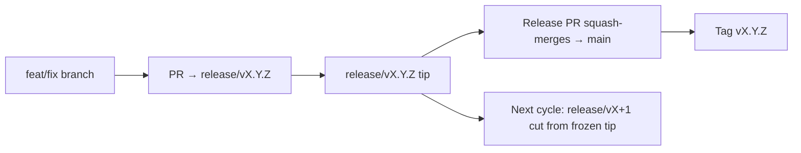

# Model gałęzi i wydań

OmniRoute stosuje model wydań oparty na **równoległych cyklach**: dedykowana gałąź
`release/vX.Y.Z` dla aktywnego cyklu, `main` dla opublikowanej linii oraz niezmienny
tag `vX.Y.Z`, gdy dany cykl trafia do produkcji. Widok commitów lądujących na
`release/*` _oraz_ na `main` jest oczekiwany — to nie pomyłka.

Szczegóły dla maintainerów znajdują się w `CLAUDE.md` (Hard Rule #21) oraz w
[RELEASE_CHECKLIST.md](./RELEASE_CHECKLIST.md). Ta strona to publiczne
podsumowanie skierowane do contributorów.

## W skrócie

| Ref              | Rola                                                                                        |
| ---------------- | ------------------------------------------------------------------------------------------- |
| `release/vX.Y.Z` | **Aktywny cykl** — codzienna praca deweloperska i merge PR-ów dla tej wersji                |
| `main`           | **Opublikowana linia** — przyjmuje cykl przez squash-merge w momencie wydania               |
| `vX.Y.Z` (tag)   | **Znacznik wydania** — niezmienny wskaźnik „co zostało wydane”, tworzony w momencie release |



## Na którą gałąź celować PR?

**Celuj w aktywną gałąź `release/vX.Y.Z` — nie w `main`.**

1. Znajdź najwyższą otwartą gałąź `release/v*` (przykład w momencie pisania:
   `release/v3.8.49`).
2. Utwórz gałąź od jej tipa (`git fetch` + checkout / rebase na nią).
3. Otwórz PR z **base = ta `release/vX.Y.Z`**.

`main` nie jest codzienną gałęzią integracyjną. PR-y otwarte względem `main`
zazwyczaj wymagają zmiany celu (retarget) przed merge.

## Zamrożenie wydania (równoległe cykle)

Gdy wydanie jest uzgadniane, otwierane jest issue-znacznik z etykietą `release-freeze`.
To **nie wstrzymuje rozwoju**:

- Zamrożona `release/vX.Y.Z` należy do kapitana wydania (release captain) tego shipu.
- Kolejny cykl `release/vX+1` jest odcinany od zamrożonego tipa, dzięki czemu
  contributorzy mogą dalej lądować pracę.
- Otwarte PR-y, które nadal celują w zamrożoną gałąź, powinny zostać **przekierowane**
  (retarget) na aktywną (najwyższą) gałąź `release/v*`.

Sprawdź, czy jest otwarte zamrożenie, zanim założysz, że wybrana gałąź jest gotowa do merge:

```bash
gh issue list --repo diegosouzapw/OmniRoute --label release-freeze --state open
```

Mechanika merge (etykieta właściciela `queue` → Mergify) jest opisana w
[MERGE_TRAIN.md](./MERGE_TRAIN.md).

## Po co i gałąź, i tag?

| Artefakt         | Czas życia  | Cel                                                                |
| ---------------- | ----------- | ------------------------------------------------------------------ |
| `release/vX.Y.Z` | Cykl w toku | Zbiera zrecenzowane PR-y, utrzymuje CI na zielono, jest base PR-ów |
| Tag `vX.Y.Z`     | Na zawsze   | Oznacza dokładne bity, które trafiły do npm / GitHub Releases      |

Gałąź to warsztat; tag to zapieczętowana paczka. Po squash-merge do
`main` kolejny cykl kontynuuje na `release/vX+1` bez czekania na zakończenie
poprzedniego release PR.

## Powiązane dokumenty

- [CONTRIBUTING.md](../../CONTRIBUTING.md) — setup, testy, checklista PR
- [RELEASE_CHECKLIST.md](./RELEASE_CHECKLIST.md) — walidacja przed wydaniem
- [MERGE_TRAIN.md](./MERGE_TRAIN.md) — kolejka merge i zapasowy train
- [RELEASE_GREEN.md](./RELEASE_GREEN.md) — utrzymanie zielonego tipa wydania
