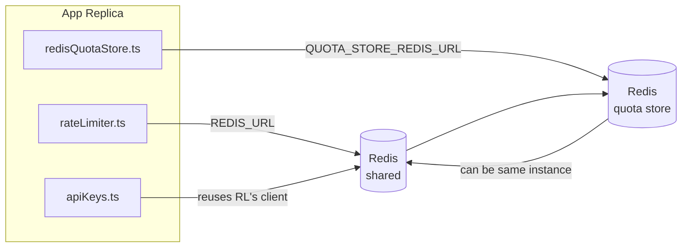

# Przewodnik konfiguracji Redis w produkcji

## Przegląd

Redis to **opcjonalna, miękka zależność** w OmniRoute — aplikacja degraduje się łagodnie (fallbacki
w pamięci), gdy Redis jest niedostępny. W produkcji strojenie Redis zmniejsza opóźnienia dla trzech
odrębnych obciążeń:

| Obciążenie    | Sterownik            | Fabryka klienta                                 | Wzorzec kluczy                    |
| ------------- | -------------------- | ----------------------------------------------- | --------------------------------- |
| Rate limiting | `rateLimiter.ts`     | `getRedisClient()` — leniwy singleton `ioredis` | Okna rate limit z atomowością Lua |
| Cache auth    | `apiKeys.ts`         | Ponownie używa klienta `rateLimiter`            | `auth:api_key:<sha256>` z TTL     |
| Magazyn quota | `redisQuotaStore.ts` | Osobny singleton `getRedisClient(url)`          | Konfigurowalny per instancja      |

---

## Bieżąca konfiguracja (domyślne wartości w kodzie)

| Ustawienie                                   | Wartość                                                    | Gdzie                                |
| -------------------------------------------- | ---------------------------------------------------------- | ------------------------------------ |
| Zmienna środowiskowa `REDIS_URL`             | `redis://redis:6379` (compose), opcjonalna                 | `rateLimiter.ts:5`, `.env.example`   |
| Zmienna środowiskowa `QUOTA_STORE_REDIS_URL` | osobna, może różnić się od `REDIS_URL`                     | `quota/storeFactory.ts`              |
| `QUOTA_STORE_DRIVER`                         | `"sqlite"` (domyślnie), `"redis"` opcjonalnie              | `quota/storeFactory.ts`              |
| ioredis `maxRetriesPerRequest`               | `3`                                                        | tworzenie klienta w `rateLimiter.ts` |
| `enableReadyCheck`                           | nieustawione (domyślnie ioredis: `true`)                   | —                                    |
| `lazyConnect`                                | nieustawione (domyślnie ioredis: `false`)                  | —                                    |
| `retryStrategy`                              | nieustawione (domyślnie ioredis: baza 200 ms, wykładniczo) | —                                    |
| TLS / hasło / indeks DB                      | **nieskonfigurowane**                                      | —                                    |
| Sentinel / Cluster                           | **nieskonfigurowane** — tylko samodzielny pojedynczy węzeł | —                                    |

---

## Zalecane strojenie produkcyjne

### 1. Pula połączeń / opcje klienta (konstruktor ioredis `Redis`)

Obecny kod tworzy pojedyncze `new Redis(url)` bez własnych opcji. W produkcyjnych
wdrożeniach multi‑replica przekaż fabrykę klienta w kodzie albo owiń `getRedisClient()`:

```typescript
const redis = new Redis(REDIS_URL, {
  maxRetriesPerRequest: null, // no retry limit; let retryStrategy decide
  enableReadyCheck: true, // verify server is ready before accepting calls
  lazyConnect: true, // don't connect on construction; wait for first call
  retryStrategy: (times) => {
    if (times > 10) return null; // give up after 10 retries → reconnect later
    return Math.min(times * 200, 5000); // 200ms, 400ms, …, 5s cap
  },
  enableAutoPipelining: true, // coalesce concurrent commands into one TCP write
  keepAlive: 10000, // TCP keep‑alive every 10s
});
```

**Kluczowe kompromisy:**

- `maxRetriesPerRequest: null` + `retryStrategy` — preferowane w produkcji, aby chwilowe
  restarty Redis nie powodowały natychmiastowej awarii każdego żądania. Fallback w pamięci w
  `checkRateLimit()` obsługuje ścieżkę błędu.
- `lazyConnect: true` — unika zależności startowej od dostępności Redis, zanim serwer
  zacznie przyjmować połączenia.
- `enableAutoPipelining: true` — zmniejsza liczbę round-tripów przy współbieżnych sprawdzeniach rate-limit;
  korzystne przy >50 RPS na jednym połączeniu.

### 2. Konfiguracja serwera Redis (`redis.conf`)

```
# Memory
maxmemory 80%                        # leave room for OS page cache
maxmemory-policy allkeys-lru         # evict stale auth cache entries under pressure

# Persistence (optional — OmniRoute is crash‑safe without it)
save 300 1                           # snapshot at least every 5 min if ≥1 key changed
appendonly no                        # AOF not needed; data is regeneratable
appendfsync no                       # no fsync overhead (RDB is sufficient)

# Networking
timeout 0                            # no idle disconnect
tcp-keepalive 300                    # 5 min keep‑alive
tcp-backlog 511                      # connection backlog for bursty load

# Performance
hz 10                                # default; 100 for latency‑sensitive
activedefrag yes                     # auto‑defragment when fragmentation >10%
```

**Kompromis dla `maxmemory-policy allkeys-lru`:** Wpisy cache auth mogą zostać usunięte przy
presji pamięci. To bezpieczne — `setCachedApiKey` zawsze uzupełnia cache przy miss, a
fallback SQLite jest autorytatywny. Skrypt Lua rate-limitera tworzy małe klucze, które z
założenia są krótkotrwałe.

### 3. Ustawienia Docker Compose

Produkcyjny compose (`docker-compose.prod.yml`) używa `redis:8.6.2-alpine`. Dodaj:

```yaml
redis:
  image: redis:8.6.2-alpine
  command:
    [
      "redis-server",
      "--maxmemory",
      "512mb",
      "--maxmemory-policy",
      "allkeys-lru",
      "--activedefrag",
      "yes",
      "--save",
      "300 1",
    ]
  healthcheck:
    test: ["CMD", "redis-cli", "ping"]
    interval: 10s
    timeout: 3s
    retries: 3
    start_period: 5s
```

### 4. Uwagi dotyczące wielu instancji / skalowania

**Jeden Redis dla wszystkich replik** — skrypt Lua rate-limitera zależy od jednej
autorytatywnej przestrzeni kluczy. Wiele instancji Redis za replikami straciłoby atomowość
i podwoiłoby budżet. Używaj jednego Redis (lub klastra Redis Sentinel z failover) dla
wszystkich replik aplikacji.

**Liczba połączeń:** Każda replika aplikacji otwiera **2 połączenia TCP** do Redis
(klient rate limitera + klient magazynu quota). Przy 10 replikach → 20 połączeń, znacznie
poniżej domyślnego limitu 10k połączeń instancji Redis.

### 5. Monitoring

Udostępnij przez endpoint health-check:

```typescript
// src/app/api/monitoring/health/route.ts already calls rateLimiter functions
// Add Redis-specific checks:
//   1. PING latency via ioredis .ping()
//   2. Memory usage via INFO memory
//   3. Connection count via INFO clients
//   4. Hit rate for maxmemory-policy (evicted_keys / keyspace_hits)
```

Kluczowe metryki do obserwacji:

- **Evicted keys / sec** — jeśli trwale niezerowe, zwiększ `maxmemory`
- **Blocked clients** — wartość niezerowa sugeruje wolne skrypty Lua lub wysoką kontencję
- **Rejected connections** — osiągnięty limit połączeń; rzadkie przy 20 połączeniach

---

## Diagram architektury



---

## Odnośniki

| Plik                               | Przeznaczenie                                                  |
| ---------------------------------- | -------------------------------------------------------------- |
| `src/shared/utils/rateLimiter.ts`  | Główny klient Redis, skrypt Lua rate-limit, fallback w pamięci |
| `src/lib/db/apiKeys.ts`            | Cache auth — fallback Redis→SQLite                             |
| `src/lib/quota/redisQuotaStore.ts` | Osobny klient Redis dla opcjonalnego magazynu quota            |
| `src/lib/quota/storeFactory.ts`    | Przełącza sterowniki quota między `sqlite` a `redis`           |
| `docker-compose.prod.yml`          | Kontener Redis w prod (obraz `redis:8.6.2-alpine`)             |
| `.env.example`                     | Dokumentacja zmiennych środowiskowych Redis                    |
| `src/app/api/local/redis/`         | Trasy API do orkiestracji kontenera dev                        |
| `bin/cli/commands/redis.mjs`       | Komendy CLI do orkiestracji kontenera dev                      |
